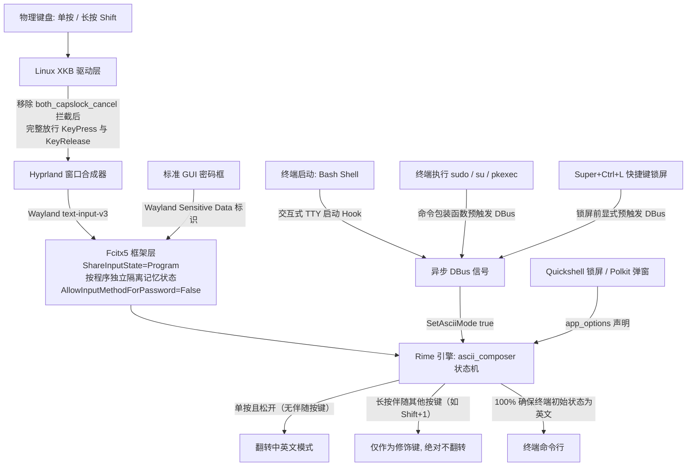

# Fcitx5 与 Rime (雾凇拼音) 输入法优化配置指南
> 本文档旨在指导如何在 Linux Wayland (Hyprland) 环境下，实现**媲美 Windows 原生输入法的极佳输入体验**：
> 1. **单按 Shift 并在松开后切换中英文**；
> 2. **长按 Shift 组合键（如按住 Shift 敲 1 输入感叹号 `!`、或配合字母输入大写）绝不误切中英文**；
> 3. **统一标点映射**，在中文或英文模式下均输入标准半角感叹号 `!`；
> 4. **新开终端 100% 默认英文模式**，输入命令不弹候选框，需要时在终端内单按 Shift 仍可随时无缝切回中文；
> 5. **所有密码输入场景 100% 默认英文模式**，涵盖终端 `sudo`/`su`、系统锁屏界面、Polkit 提权弹窗、密码管理器以及网页标准密码字段，彻底告别密码输错。

---

## 一、核心痛点与问题根源

| 现象 | 表现与困扰 | 底层根因 |
| :--- | :--- | :--- |
| **痛点 1：按住 Shift 即触发切换** | 按住 Shift 准备按 `!`（Shift+1）时，刚按下 Shift 输入法就切了，导致打出一长串中英混杂感叹号（`!！！！`）。 | 错误地在 Rime 的 `key_binder` 中配置了按键监听。`key_binder` 监听的是 **KeyDown（按下事件）** 而非松开事件。 |
| **痛点 2：物理键盘单按 Shift 毫无反应** | 配置了 Shift 切换后，虚拟按键能切，但真实物理键盘按 Shift 毫无反应。 | 系统 Linux XKB 键盘驱动默认启用了 `shift:both_capslock_cancel` 规则，**驱动层把单按 Shift 的 KeyUp（松开）事件拦截吃掉**用于取消大写锁，导致输入法根本收不到松开信号。 |
| **痛点 3：终端默认英文无法真正落地** | 之前窗口是中文，新开终端就是中文；之前是英文，新开终端才是英文。 | Fcitx5 默认 `ShareInputState=No`，新窗口会直接复制继承前一个活跃窗口的状态；且 Wayland 客户端异步握手导致 Rime 原生静态配置无法在窗口建立瞬间精准置位。 |
| **痛点 4：配置 app_options 导致终端被锁死** | 试图在 Rime 的 Schema 中给终端配置 `ascii_mode: true`，结果终端直接被永久锁死在英文，按 Shift 完全无法切中文。 | Rime 的 Schema 级 `app_options` 机制是硬性锁定，而不是单纯的“初始状态设置”。 |
| **痛点 5：输入密码时混入拼音/中文** | 终端敲 `sudo` 输密码、或锁屏后唤醒输密码时，因前置状态是中文，导致敲入密码变成拼音候选框甚至认证失败。 | 终端模拟器无法向输入法声明“这是密码字段”；锁屏和提权认证弹窗未显式配置强制英文状态。 |

---

## 二、全链路架构流程图

输入事件自下而上穿透物理硬件、窗口合成器到输入法引擎：



---

## 三、完整优化操作（共 6 步）

### 步骤 1：物理键盘驱动层配置（放行 Shift 松开信号）

> [!IMPORTANT]
> 必须移除 Linux XKB 键盘配置中的 `shift:both_capslock_cancel`。

#### 操作：
* **Omarchy / Lua 格式配置**（`~/.config/hypr/input.lua`）：
  ```lua
  hl.config({
    input = {
      follow_mouse = 0,
      -- 关键：只保留 compose:caps，绝不添加 shift:both_capslock_cancel
      kb_options = "compose:caps",
    },
  })
  ```
* **标准 Hyprland 配置**（`~/.config/hypr/hyprland.conf`）：
  ```ini
  input {
      kb_options = compose:caps
  }
  ```

#### 立即生效：
```bash
hyprctl reload config-only
```

---

### 步骤 2：Rime 引擎状态机配置（松开切换 + 标点统一）

使用 Rime 内置的修饰键状态机（`ascii_composer/switch_key`），杜绝使用 `key_binder`。

#### 操作：
1. **全局方案补丁**（编辑 `~/.local/share/fcitx5/rime/default.custom.yaml`）：
   ```yaml
   patch:
     schema_list:
       - schema: rime_ice           # 雾凇拼音（首选）
       - schema: luna_pinyin        # 明月拼音

     # 原生修饰键状态机：单按松开才切换，长按组合键绝不误切
     "ascii_composer/switch_key/Shift_L": commit_code
     "ascii_composer/switch_key/Shift_R": commit_code

     # 标点映射：全角/半角均输出英文字符 !
     "punctuator/half_shape/!": "!"
     "punctuator/full_shape/!": "!"
   ```
   > [!WARNING]
   > **切勿在 `default.custom.yaml` 或 `rime_ice.custom.yaml` 中配置 `app_options`！**  
   > 写入 Schema patch 的 `app_options` 会被 Rime 引擎在底层将对应应用硬性锁定在 ASCII 模式，导致用户在该应用内按 Shift 无法切换中文。针对特定窗口的初始纯英文策略，必须且只能配置在 `fcitx5.yaml` 中由 Fcitx5 前端调度（详见步骤 6）。

2. **独立方案补丁**（编辑 `~/.local/share/fcitx5/rime/rime_ice.custom.yaml`）：
   ```yaml
   patch:
     "ascii_composer/switch_key/Shift_L": commit_code
     "ascii_composer/switch_key/Shift_R": commit_code
     "punctuator/half_shape/!": "!"
     "punctuator/full_shape/!": "!"
   ```

> [!NOTE]
> `commit_code` 的含义：当处于中文拼音输入中途单击 Shift 时，会将当前未完成的拼音编码直接上屏并切换到英文状态，避免字母丢失。

---

### 步骤 3：标点符号完全对齐 Windows 微软拼音（零候选框、单按直出、回车逻辑解析）

很多从 Windows 迁移到 Linux 的用户在使用 Rime / 雾凇拼音时，会遇到极为困惑的标点行为：
1. **多选候选弹窗**：按下 `\` 弹出 `1 、 2 \ 3 ＼`；按下 `>` 弹出 `1 》 2 〉 3 » 4 ›`；按下 `$` 弹出 `1 ￥ 2 $ 3 € ...`；按下 `[` 弹出 `1 「 2 【 3 〔 4 ［`。
2. **回车异常上屏**：在候选浮窗出现时，按 Enter 键期望确认第 1 候选（如 `、`），结果却输出了第 2 候选（原生 ASCII `\`）。

> [!IMPORTANT]
> **标点三大核心疑问底层根因解析**：
> 1. **为什么直接敲回车上了第 2 项（`\`）而不是第 1 项（`、`）？**
>    - 在 Rime 状态机中，**空格键（Space）** 对应 `commit_candidate`（提交当前选中的第 1 候选）。
>    - 而 **回车键（Enter）** 对应的是 `commit_raw_input`（废弃当前所有候选词，直接上屏用户物理键盘敲击的原生 ASCII 裸码）。当用户按下了物理键 `\` 时，原生输入字符正是 `\`。在默认候选列表中，半角 `\` 恰好被排在第 2 位，这就造成了“回车居然跳过候选 1 选了候选 2”的视觉假象。实际上回车根本不是在选字，而是在执行取消候选、裸码上屏！
> 2. **为什么会有多选候选列表？到底是谁的问题？**
>    - **归属于 Rime 上游默认设计 + 雾凇拼音直接继承**：在 `/usr/share/rime-data/punctuation.yaml` 中，Rime 原作者将大量标点定义为数组序列（如 `'\' : [ 、, '\', ＼ ]`、`'>' : [ 》, 〉, », › ]`），初衷是照顾港台繁体排版习惯。而雾凇拼音（rime-ice）直接全盘引入了 `punctuation.yaml`（`import_preset: default`），导致这些列表标点全部变成了“弹出候选框等用户按数字或空格挑选”，与 Windows 微软拼音“单按立即直出”的习惯完全脱节。
> 3. **为什么不能直接在 `default.custom.yaml` 中打补丁？**
>    - 若在 `custom.yaml` 中直接写 `"punctuator/half_shape/\\": "、"`，执行 `rime_deployer` 时会直接报错：`copy on write failed; incompatible node type: \`。这是因为底层节点原本是 sequence（数组），Rime 的 C++ patch 机制不允许将标量直接强行覆盖到数组节点上。

#### 解决方案：配置用户级 `punctuation.yaml`
Rime 方案构建时的文件加载优先级为：**用户目录 `~/.local/share/fcitx5/rime/` > 系统目录 `/usr/share/rime-data/`**。直接在用户目录提供一份全标量 `{ commit: ... }` 的 `punctuation.yaml`，即可一劳永逸对齐 Windows 微软拼音体验。

创建或覆盖 `~/.local/share/fcitx5/rime/punctuation.yaml`：
```yaml
# Rime basic symbols (Windows Microsoft Pinyin aligned)
# encoding: utf-8

full_shape:
  ' ' : { commit: '　' }
  ',' : { commit: ， }
  '.' : { commit: 。 }
  '<' : { commit: 《 }
  '>' : { commit: 》 }
  '/' : { commit: '/' }
  '?' : { commit: ？ }
  ';' : { commit: ； }
  ':' : { commit: ： }
  '''' : { pair: [ '‘', '’' ] }
  '"' : { pair: [ '“', '”' ] }
  '\' : { commit: 、 }
  '|' : { commit: '|' }
  '`' : ｀
  '~' : { commit: ～ }
  '!' : { commit: '!' }
  '@' : { commit: '@' }
  '#' : { commit: '#' }
  '%' : { commit: '%' }
  '$' : { commit: ￥ }
  '^' : { commit: …… }
  '&' : ＆
  '*' : { commit: '*' }
  '(' : （
  ')' : ）
  '-' : －
  '_' : ——
  '+' : ＋
  '=' : ＝
  '[' : { commit: 【 }
  ']' : { commit: 】 }
  '{' : { commit: '{' }
  '}' : { commit: '}' }

half_shape:
  ',' : { commit: ， }
  '.' : { commit: 。 }
  '<' : { commit: 《 }
  '>' : { commit: 》 }
  '/' : { commit: '/' }
  '?' : { commit: ？ }
  ';' : { commit: ； }
  ':' : { commit: ： }
  '''' : { pair: [ '‘', '’' ] }
  '"' : { pair: [ '“', '”' ] }
  '\' : { commit: 、 }
  '|' : { commit: '|' }
  '`' : '`'
  '~' : { commit: ～ }
  '!' : { commit: '!' }
  '@' : '@'
  '#' : '#'
  '%' : '%'
  '$' : { commit: ￥ }
  '^' : { commit: …… }
  '&' : '&'
  '*' : '*'
  '(' : （
  ')' : ）
  '-' : '-'
  '_' : ——
  '+' : '+'
  '=' : '='
  '[' : { commit: 【 }
  ']' : { commit: 】 }
  '{' : { commit: '{' }
  '}' : { commit: '}' }
```

---

### 步骤 4：Fcitx5 状态隔离与密码框自动降级纯英文（核心根因与关键配置！）

> [!IMPORTANT]
> **底层核心机制解析**：
> 1. 当系统检测到输入框具有密码属性（`CapabilityFlag::Password`，如 Polkit 提权弹窗、锁屏、浏览器密码框）且启用了 `AllowInputMethodForPassword=False` 时，Fcitx5 会在当前输入法列表中动态查找原生英文键盘布局（`keyboard-us`）。**如果输入法列表里只有 `rime`，没有配置 `keyboard-us`，Fcitx5 就会因为找不到英文降级布局而无奈回退到 Rime，导致输密码时依然弹出中文拼音候选框！**
> 2. **引入 `keyboard-us` 后的闭环保证**：输入法列表中同时存在 `rime` 和 `keyboard-us` 时，必须显式配置 `ActiveByDefault=True` 和 `[Hotkey/TriggerKeys] 0=Control+space`。否则新开应用会默认以未激活（`keyboard-us` 纯英文）状态启动，且用户按 Shift 无法激活 Rime，导致被锁死在纯英文。

#### 操作：
1. **编辑全局行为**（`~/.config/fcitx5/config`）：
   ```ini
   [Hotkey/TriggerKeys]
   0=Control+space

   [Behavior]
   # 默认激活输入法（确保程序启动时直接处于 Rime 状态，由 Rime 自行处理 Shift 中英翻转）
   ActiveByDefault=True

   # 共享输入法状态设置为 Program（按应用程序隔离，互不污染）
   ShareInputState=Program

   # 密码字段内禁用输入法（对网页密码输入框和 GUI 原生密码控件生效，自动降级 keyboard-us）
   AllowInputMethodForPassword=False
   ShowPreeditForPassword=False
   ```

2. **在输入法列表中加入原生英文键盘**（编辑 `~/.config/fcitx5/profile`）：
   ```ini
   [Groups/0]
   # Group Name
   Name=Default
   # Layout
   Default Layout=us
   # Default Input Method
   DefaultIM=rime

   [Groups/0/Items/0]
   # 主输入法保留为 rime（日常敲字）
   Name=rime

   [Groups/0/Items/1]
   # 关键：必须加入 keyboard-us 作为密码框自动降级生效的纯英文布局
   Name=keyboard-us

   [GroupOrder]
   0=Default
   ```

---

### 步骤 5：终端默认英文与密码命令自切英文 Hook

通过轻量级 Shell Hook，在终端启动及调用密码命令时瞬间通过 DBus 将输入法置为英文状态。

#### 操作：
在用户的 `~/.bashrc`（或对应的 `.zshrc`）末尾追加：
```bash
# 1. 终端交互式会话启动时默认进入英文输入状态（按 Shift 可随时切回中文）
if [[ $- == *i* ]] && [ -t 0 ] && [ -n "$WAYLAND_DISPLAY$DISPLAY" ]; then
    (gdbus call --session --dest org.fcitx.Fcitx5 --object-path /rime --method org.fcitx.Fcitx.Rime1.SetAsciiMode true >/dev/null 2>&1 &)
fi

# 2. 执行涉及密码输入的命令前，自动将输入法切回英文模式（避免密码输入中混入中文/拼音）
for __pwd_cmd in sudo su pkexec passwd ssh doas; do
    eval "
    $__pwd_cmd() {
        (gdbus call --session --dest org.fcitx.Fcitx5 --object-path /rime --method org.fcitx.Fcitx.Rime1.SetAsciiMode true >/dev/null 2>&1 &)
        command $__pwd_cmd \"\$@\"
    }
    "
done
unset __pwd_cmd
```

* **特性说明**：
  1. `(... &)`：子进程后台异步运行，耗时 **0ms**，不产生任何等待延迟；
  2. **不锁死状态**：仅在命令启动瞬间置为英文，在任何时候按下 Shift 依然可以自由翻转中英文。

---

### 步骤 6：系统锁屏与认证弹窗强制英文配置

1. **配置快捷键锁屏触发切英文**（编辑 `~/.config/hypr/bindings.lua`）：
   ```lua
   -- 锁屏时自动将输入法切回英文模式，确保解锁输入密码为英文字符
   hl.unbind("SUPER + CTRL + L")
   o.bind("SUPER + CTRL + L", "Lock system", "bash -c 'gdbus call --session --dest org.fcitx.Fcitx5 --object-path /rime --method org.fcitx.Fcitx.Rime1.SetAsciiMode true >/dev/null 2>&1; omarchy-system-lock'")
   ```
   *修改后执行 `hyprctl reload config-only` 生效。*

2. **配置 Rime 应用程序级别策略**（编辑 `~/.local/share/fcitx5/rime/fcitx5.yaml`）：
   在 `app_options:` 下确保包含如下应用：
   ```yaml
   app_options:
     quickshell:
       ascii_mode: true
     pinentry:
       ascii_mode: true
     pinentry-qt:
       ascii_mode: true
     pinentry-gnome3:
       ascii_mode: true
     pinentry-gtk-2:
       ascii_mode: true
     hyprpolkitagent:
       ascii_mode: true
     polkit-gnome-authentication-agent-1:
       ascii_mode: true
     org.kde.polkit-kde-authentication-agent-1:
       ascii_mode: true
     lxqt-policykit-agent:
       ascii_mode: true
     1Password:
       ascii_mode: true
     1password:
       ascii_mode: true
     org.keepassxc.KeePassXC:
       ascii_mode: true
     keepassxc:
       ascii_mode: true
     Bitwarden:
       ascii_mode: true
     bitwarden:
       ascii_mode: true
     com.bitwarden.desktop:
       ascii_mode: true
   ```

---

### 步骤 7：编译部署与生效

执行以下命令编译 Rime 二进制 Schema 缓存并重启输入法服务：

```bash
# 1. 重新编译 Rime 方案二进制库
rime_deployer --build ~/.local/share/fcitx5/rime /usr/share/rime-data ~/.local/share/fcitx5/rime/build

# 2. 同步配置到 build 目录
cp ~/.local/share/fcitx5/rime/fcitx5.yaml ~/.local/share/fcitx5/rime/build/fcitx5.yaml

# 3. 彻底重启 Fcitx5 服务（关键！切勿仅使用 fcitx5-remote -r）
# 底层根因：fcitx5-remote -r 仅重载配置，不会重载 profile 输入法列表与内存中的 Rime 状态机！
# 必须彻底重启进程，Fcitx5 才会重新读取 profile 与全新编译的 schema。
systemctl --user restart omarchy-fcitx5.service 2>/dev/null || (pkill -x fcitx5 && sleep 0.5 && (pgrep -x fcitx5 >/dev/null || fcitx5 -d >/dev/null 2>&1))
```

---

## 四、全场景验证清单（请按顺序测试）

1. **终端默认英文测试**：
   * 在浏览器里将输入法切换为【中文】，输入框能打出汉字；
   * 此时按快捷键（如 `Super + Return`）新开一个终端窗口；
   * **在终端内直接敲命令（如 `git status`、`ls`）**：验证是否 100% 默认纯英文上屏，**绝不弹出中文拼音候选框**。
2. **终端切中文测试**：
   * 在上述终端中，**单按一次左 Shift 并松开**；
   * 输入 `ceshi` + 空格：验证是否成功弹出拼音候选框并上屏汉字 `测试`。
3. **感叹号防误切测试**：
   * 在上述中文状态下，**按住 Shift 连续敲击数字键 `1`（输入感叹号）**；
   * 验证是否连续输出英文半角感叹号 `!!!`，且松开 Shift 后输入法**未被误切**。
4. **终端切回英文测试**：
   * 再次**单按一次左 Shift 并松开**；
   * 输入 `clear` + 回车：验证是否顺畅切回纯英文并执行清屏。
5. **多窗口状态隔离测试**：
   * 鼠标点回刚才的浏览器窗口：验证浏览器是否仍保持在【中文模式】，没有被终端的英文状态带跑。
6. **密码命令自动切英文测试（核心）**：
   * 在终端中，单按 Shift 故意切换到【中文模式】；
   * 输入 `sudo echo 1` 并按回车；
   * 当弹出 `[sudo] password for ...:` 时，**直接敲击密码字符**：验证是否无需手动按 Shift 即可直接输入英文字符，无任何拼音候选框。
7. **快捷键锁屏测试**：
   * 在中文模式下，按 `Super + Ctrl + L` 锁屏；
   * 唤醒屏幕输入解锁密码：验证是否直接输入密码点，绝无中文拼音候选框。
8. **图形提权弹窗测试（Polkit 弹窗）**：
   * 触发图形提权（如在终端运行 `pkexec ls` 或启动 Windows VM 弹窗）；
   * 弹出 `Authorize running ... / Enter password` 弹窗后，直接敲击密码字符；
   * 验证是否直接以纯英文输入，绝不弹出中文拼音候选框。
9. **Windows 原生中文标点直出测试（零候选弹窗）**：
   * 在中文模式下，分别敲击键盘标点：
     * 按 `\` 键：**立即直接上屏 `、`**，绝不弹出 `1 、 2 \ 3 ＼` 多选浮窗；
     * 按 `Shift + .`（`>` 键）：**立即直接上屏 `》`**，绝不弹出 `1 》 2 〉 3 »` 浮窗；
     * 按 `Shift + 4`（`$` 键）：**立即直接上屏 `￥`**，绝不弹出货币符号浮窗；
     * 按 `[` 和 `]` 键：**分别立即直接上屏 `【` 和 `】`**，绝不弹出 `「` 或 `」`；
     * 按 `Shift + 6`（`^` 键）：**立即直接上屏 `……`** 省略号；
     * 按 `Shift + -`（`_` 键）：**立即直接上屏 `——`** 破折号。

---

## 五、关键命令与状态排查

| 操作目的 | 检查/调试命令 | 预期结果 |
| :--- | :--- | :--- |
| **检查物理键盘 XKB 选项** | `hyprctl getoption input:kb_options` | 必须为 `str: compose:caps`，绝不能有 `both_capslock_cancel` |
| **检查当前聚焦窗口模式** | `gdbus call --session --dest org.fcitx.Fcitx5 --object-path /rime --method org.fcitx.Fcitx.Rime1.IsAsciiMode` | 英文输出 `(true,)`，中文输出 `(false,)` |
| **检查 Fcitx5 运行状态** | `fcitx5-remote` | 正常运行应输出 `2` |
| **检查 sudo 命令包装状态** | `type sudo` | 应显示为包含 `SetAsciiMode true` 的 shell 函数 |
