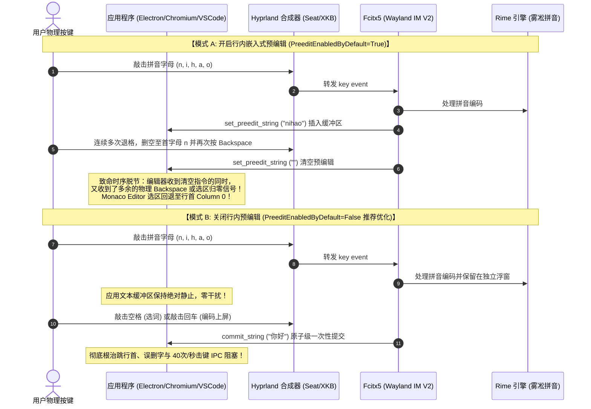

# Fcitx5 在 Wayland 下退格跳行首、回车空格误删与候选框漂移排查调优指南（Preedit 预编辑机制、Wayland V2 虚拟键盘常驻、字号与高亮黑底定制）

> **适用环境**：Arch Linux + Hyprland (Omarchy)  
> **面向用户**：在 Linux Wayland 下高频编写代码、使用终端与浏览器，遇到拼音输入异常跳跃、误删及界面排版问题的重度开发者  
> **核心收益**：彻底根治拼音退格删空时光标跳行首、敲回车空格吞字误删及输入瞬时卡顿；掌握 Wayland 惰性光标上报机制；配置 12pt 精致字号与纯黑高亮候选词主题；激活 `Ctrl + Alt + P` 动态热键与 `Ctrl + Space` 极速唤醒。

---

## 一、背景与核心痛点

在 Linux Wayland (Hyprland) 环境下使用 **Fcitx5 + Rime（雾凇拼音）** 进行高频开发时，常常会遭遇以下几类极具破坏性的交互 Bug：

| 痛点场景 | 典型表现 | 业务危害 |
| :--- | :--- | :--- |
| **痛点 1：退格删到首字跳行首** | 输入一长串拼音后多次按 Backspace，当删到最后一个字母再退格时，光标瞬间跳到当前行甚至前几行的最开头（Column 0）。 | 严重打断思考，后续敲击的字符会直接插入在错误的代码位置，造成文件语法破坏。 |
| **痛点 2：敲回车或空格误删字** | 正常打字敲空格（选词上屏）或敲回车（字母上屏）时，输入框内原本已有的既有文字或前序代码被突然“冲刷覆盖/误删”。 | 造成编辑中的代码、命令或文档内容丢失，且通常伴随瞬间击键卡顿。 |
| **痛点 3：切换输入框首字在左侧** | 鼠标切换或 Tab 键进入新的输入框（如浏览器地址栏），敲击第 1 个字母时候选框出现在屏幕左边中部，敲出字后才瞬移吸附到输入框。 | 候选框突兀瞬移，视觉产生晃动感。 |
| **痛点 4：悬浮弹窗拼音失灵** | 呼出 Quick Open 或悬浮窗口时，输入法处于纯英文状态，单按 Shift 无法切换拼音。 | 误以为输入法损坏，往往需要切到其它正常应用打一下字才能折返回来。 |
| **痛点 5：候选框字号偏小与对比度不足** | 默认 10pt 字号在 1.25x 或 2K 缩放屏幕下偏小，首选候选词底色为浅灰（`#808080`），对比度不足。 | 长时间敲击视疲劳，视觉辨识效率较低。 |

---

## 二、第一性原理与底层物理链路推导

### 1. 全链路协议时序图

输入事件从硬件自下而上穿透窗口合成器与输入法引擎：



### 2. 核心机理剖析

#### （1）痛点 1 与 2 的根因：行内预编辑（Inline Preedit）时序重入
* **为什么删到首字跳行首？** 当 `PreeditEnabledByDefault=True` 时，拼音拼写字母实时插入到应用的文本缓冲区中。当按 Backspace 删到最后一个字母清空时，Fcitx5 派发清空指令，但 Chromium / Monaco Editor 处理 IME Composition 结束的时序滞后，将残留的 Backspace 按键作为普通编辑指令继续执行，加之 Monaco 编辑器内部对非法选区的安全回退机制，将光标强制重置到了行首（Column 0）。
* **为什么敲回车或空格误吞字并卡顿？** 在 Wayland `text-input-v3` 序列号确认机制下，高按键重复率（系统默认 40次/秒）导致频繁的 Preedit 重绘与 IPC 往返，造成应用渲染线程暂时锁步阻塞（卡顿）。当回车/空格按键到达时，应用尚处于 selection 状态未完全解除，随后的按键直接将选区内的既有文字覆盖冲刷。
* **物理级根治**：将 `PreeditEnabledByDefault` 设为 `False`，拼音字母完整收敛在 Fcitx5 悬浮候选框内，应用缓冲区在选词前保持 100% 静止，彻底切断了上述 Bug 发生的物理条件。

#### （2）痛点 3 的根因：Wayland 惰性光标上报（Lazy Caret Reporting）
* **为什么切换输入框后首字在左侧？** Wayland 架构出于安全沙箱考量，禁止输入法自行探测全局像素。候选框位置完全由应用程序通过 `set_cursor_rectangle` 上报给 Hyprland。现代 GUI 框架在用户仅仅“点击或切换焦点”进入输入框时，由于内容未发生任何改变，为了节约性能**不会立即计算绝对屏幕坐标**，此时上报的坐标为未初始化的 `(0, 0)`。
* 当敲下第 1 个字母时，Fcitx5 必须在第 1 微秒弹窗，Hyprland 根据 `(0, 0)` 叠加上窗口边框和 1.25x 屏幕缩放，将候选框 fallback 摆在窗口左侧边界；当第 1 个字母处理完成后，应用排版引擎强制重绘并补发了真实坐标，候选框立刻瞬移吸附到光标处。

#### （3）痛点 4 的根因：子表面焦点未就绪
* 悬浮弹窗刚唤起时，Wayland 合成器尚未向 Fcitx5 派发 `text_input.enable`，此时输入法处于 Inactive 状态。单按 Shift 属于 Rime 引擎内部逻辑，无法在未激活的全局状态下生效。直接按下 Fcitx5 全局热键 **`Ctrl + Space`** 即可在当前表面强制就地唤醒拼音。

---

## 三、全场景调优配置落地（共 5 步）

### 步骤 1：关闭应用内嵌入预编辑（根治跳行首、误删与卡顿）

编辑 `~/.config/fcitx5/config`：
```ini
[Behavior]
# 关闭在应用程序中显示预编辑文本，将拼音字母收敛至候选框浮动窗
PreeditEnabledByDefault=False
```

### 步骤 2：理解预编辑配置在 Rime 引擎下的生效机理（重要）

> [!NOTE]
> **底层机理解析（对抗性审查）**：
> Fcitx5 全局快捷键 `[Hotkey/TogglePreedit] Control+Alt+P` 仅对 Fcitx5 自带的内置拼音引擎（`fcitx5-pinyin`）支持动态热切换。
> 而我们系统中使用的是 **Rime（雾凇拼音）** 引擎，Rime 是独立的第三方状态机，它在会话建立时会读取 `PreeditEnabledByDefault` 参数决定预编辑形态，但**在运行时并不响应 Fcitx5 的动态 TogglePreedit 热键信号**。
> 因此，切换预编辑模式必须通过修改 `~/.config/fcitx5/config` 中的 `PreeditEnabledByDefault=True/False` 并重启服务来生效。

### 步骤 3：部署 Wayland V2 虚拟键盘常驻与按键放行

创建并编辑 `~/.config/fcitx5/conf/waylandim.conf`：
```ini
# ~/.config/fcitx5/conf/waylandim.conf
# 保持 V2 协议虚拟键盘对象常驻，防止浮动窗口/子弹窗在失去激活事件时被彻底销毁通信管道
PersistentVirtualKeyboard=True
# 允许未处理的按键事件正常转发
PreferKeyEvent=True
```

### 步骤 4：经典 UI 字体调大（12pt）与纯黑高亮候选词定制

#### 1. 创建高对比度黑色高亮主题
在用户主题目录下创建 `~/.local/share/fcitx5/themes/black-highlight/theme.conf`：
```ini
# ~/.local/share/fcitx5/themes/black-highlight/theme.conf
[Metadata]
Name=Black Highlight
Version=1
Author=Omarchy
Description=Default theme with black highlight background
ScaleWithDPI=True

[InputPanel]
NormalColor=#000000
HighlightColor=#ffffff
PageButtonAlignment=Last Candidate

[InputPanel/TextMargin]
Left=5
Right=5
Top=5
Bottom=5

[InputPanel/ContentMargin]
Left=2
Right=2
Top=2
Bottom=2

[InputPanel/Background]
Color=#ffffff
BorderColor=#c0c0c0
BorderWidth=2

[InputPanel/Background/Margin]
Left=2
Right=2
Top=2
Bottom=2

# 关键：将候选词高亮背景调整为纯黑 #000000，文字保持纯白 #ffffff
[InputPanel/Highlight]
Color=#000000

[InputPanel/Highlight/Margin]
Left=5
Right=5
Top=5
Bottom=5

[Menu/Highlight]
Color=#000000

[Menu/Highlight/Margin]
Left=5
Right=5
Top=5
Bottom=5
```
并同步复制默认的矢量图标组件：
```bash
cp /usr/share/fcitx5/themes/default/*.svg ~/.local/share/fcitx5/themes/black-highlight/
```

#### 2. 配置 ClassicUI 样式与字号
编辑 `~/.config/fcitx5/conf/classicui.conf`：
```ini
# ~/.config/fcitx5/conf/classicui.conf
# 垂直候选列表 (False 为水平排列)
Vertical Candidate List=False
# 使用屏幕独立 DPI
PerScreenDPI=True
# 输入与候选词字体（调整为 12pt）
Font="Sans 12"
# 菜单字体
MenuFont="Sans 12"
# 托盘字体
TrayFont="Sans Bold 10"
# 应用纯黑高亮主题
Theme=black-highlight
```

### 步骤 5：服务热重载与守护进程纳管

在 Omarchy 环境中，Fcitx5 由 `systemd --user` 的 `omarchy-fcitx5.service` 纳管。执行以下命令清理临时 DBus 激活冲突并平滑重载：
```bash
# 清理可能存在的瞬态 DBus 冲突单元并平滑重启服务
systemctl --user stop "dbus-*org.fcitx.Fcitx5*" 2>/dev/null
systemctl --user restart omarchy-fcitx5.service
```

---

## 四、验证与全场景测试清单

| 测试项目 | 测试动作 | 预期标准结果 |
| :--- | :--- | :--- |
| **1. 连续退格测试** | 在 VS Code / Antigravity / 网页中输入长拼音 `ceshishurufa`，长按 Backspace 删到最后一个字母 `c` 并彻底删空。 | **100% 停留在原位**，光标绝对不跳跃到前序代码或行首。 |
| **2. 回车与空格测试** | 正常输入词组，分别用 `空格`（选词）和 `回车`（英文编码直接上屏）。 | **绝对不误吞光标前后的已有文字**，击键丝滑无卡顿。 |
| **3. 悬浮弹窗极速唤醒** | 呼出任意全局搜索弹框或浮动窗口，若遇纯英文状态。 | **直接按 `Ctrl + Space`** 即可就地激活拼音，无需折返其他应用。 |
| **4. 视觉与字号测试** | 敲击拼音呼出候选框。 | 字体为清晰舒适的 **12pt**，选中的第 1 候选词底色为醒目的**纯黑色**方块，文字为**纯白**，对比度极佳。 |
| **5. 预编辑模式切换验证** | 在 `~/.config/fcitx5/config` 中修改 `PreeditEnabledByDefault=True/False` 并重启服务。 | 可验证“候选框浮窗预编辑（无卡顿无跳跃）”与“行内嵌入预编辑（紧贴光标）”的真实差异。 |

---

## 五、关键命令速查

```bash
# 查看当前 Fcitx5 激活状态 (2 表示 Active 活跃, rime 表示引擎就绪)
fcitx5-remote && fcitx5-remote -n

# 检查 Rime 是否处于纯英文模式 (false 表示拼音模式)
gdbus call --session --dest org.fcitx.Fcitx5 --object-path /rime --method org.fcitx.Fcitx.Rime1.IsAsciiMode

# 检查服务运行状态
systemctl --user status omarchy-fcitx5.service
```
