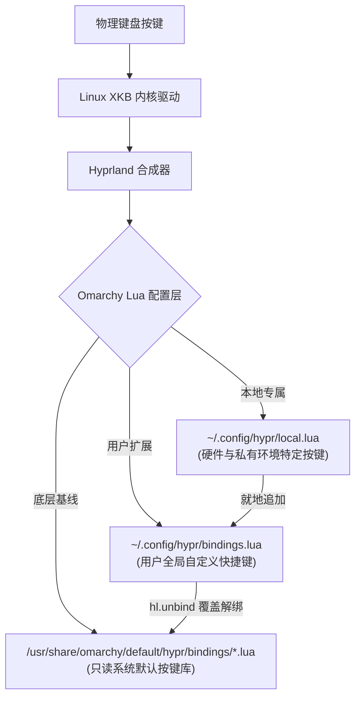

# Omarchy 高频快捷键与 F1 截图标注全攻略（Hyprland 按键拓扑、Tensaku 现代标注集成与一键配置脚本）

> **适用环境**：Omarchy (Arch Linux + Hyprland on Wayland)  
> **面向用户**：追求极致键盘流操作效率的开发运维人员、文字工作者及设计用户  
> **核心收益**：掌握 Omarchy 层次化按键拓扑机制；一键集成媲美 Snipaste 的 `F1` 现代截图标注能力；彻底规避按键冲突与无效绑定。

---

## 一、背景与核心痛点

在基于 Hyprland 平铺桌面架构的 Omarchy 系统中，键盘是最高效的生产力交互中枢。然而，很多用户在刚接触或定制系统时常常遇到以下阻碍：

1. **按键体系割裂与层级混乱**：不知道系统预设快捷键在何处定义，在 `~/.config/hypr/hyprland.lua` 盲目添加 `bind` 导致语法错误，或与 Omarchy 的 Lua 模块化配置体系脱节；
2. **快捷键冲突导致“一按多发”**：例如用户自定义 `Super + Shift + Enter` 打开 SSH 会话，却同时触发了系统默认绑定的浏览器，甚至导致终端窗口被挤压；
3. **截图工具交互落后（缺少现代批注）**：系统默认采用 `grim + slurp` 命令行截图。用户按下快捷键选定区域后，图片直接落盘或进剪贴板，无法像 Windows 上的 Snipaste 或 macOS 上的 CleanShot X 一样**在屏幕上就地进行箭头指示、红框标注、马赛克打码和文字备注**。

本文系统梳理 Omarchy 的底层按键拓扑架构，提供系统级的实用高频快捷键全景图，并手把手带你集成 Rust 打造的现代 Wayland 截图标注工具 **Tensaku**，赋予 `F1` 键极致的截图批注体验。

---

## 二、Omarchy 按键拓扑与分层机制

Omarchy 摒弃了传统庞大臃肿的单一 `hyprland.conf`，采用了基于 Lua 的模块化、分层覆盖设计：



### 1. 配置层级划分
* **系统默认库**（`/usr/share/omarchy/default/hypr/bindings/`）：系统预置的应用与窗口按键（包含 `media.lua`、`apps.lua`、`system.lua`、`voxtype.lua` 等）。由系统包管理器维护，用户**切勿直接修改**，否则系统更新时将被覆写。
* **用户覆盖库**（`~/.config/hypr/bindings.lua`）：用户的核心快捷键定制文件。在系统默认配置之后加载，具有最高的个人定制优先级。
* **本地专属库**（`~/.config/hypr/local.lua`）：用于存放与当前单台设备强相关的按键（如特定键盘的宏按键、F1 截图工具链等）。

### 2. 核心语法与防冲突黄金法则

> [!CRITICAL]
> **黄金法则：重写系统已有快捷键前，必须先调用 `hl.unbind` 显式解绑！**  
> Omarchy 使用 Lua 包装器 `o.bind(...)` 注册快捷键。如果某个组合键已被系统预设，直接使用 `o.bind` 会导致**两个动作同时触发**。必须先调用 `hl.unbind` 释放该按键：
> ```lua
> -- 错误写法：同时唤起浏览器和 SSH Spotlight！
> o.bind("SUPER + SHIFT + RETURN", "SSH", { launch = "ssh-manager" })
> 
> -- 正确写法：先解绑默认动作，再安全绑定
> hl.unbind("SUPER + SHIFT + RETURN")
> o.bind("SUPER + SHIFT + RETURN", "SSH", { launch = "ssh-manager" })
> ```

### 3. 应用启动封装规范
Omarchy 推荐三种启动语义：
* `{ launch = "app_name" }`：通过 `uwsm-app` 安全启动应用，环境变量与 D-Bus 上下文完整继承（推荐大多数本地 GUI/CLI 应用）；
* `{ omarchy = "browser" }`：调用 Omarchy 抽象默认程序（如默认浏览器、默认终端）；
* 直接传入字符串命令行：如 `"bash -c '...'"` 用于执行复杂的管道或 Shell 单行脚本。

---

## 三、Omarchy 精选好用高频快捷键速查全景图

### 1. 窗口管理与平铺控制（核心生产力）

| 快捷键 | 功能描述 | 实战技巧 / 场景 |
| :--- | :--- | :--- |
| **`Super + Return`** | 打开默认终端 | 打开轻量级原生 Wayland 终端（Foot / Alacritty） |
| **`Super + Q`** | 关闭当前聚焦窗口 | 安全退出当前应用（等同于点击窗口关闭按钮） |
| **`Super + M`** | 最大化 / 单窗沉浸模式 | 隐藏其他平铺窗格，当前窗口独占屏幕；再次按下恢复平铺 |
| **`Super + V`** | 切换当前窗口平铺/悬浮 | 将平铺窗口变为自由浮动窗口（可随意拖拽缩放） |
| **`Super + H / J / K / L`**<br>*(或 `Super + 方向键`)* | 聚焦左 / 下 / 上 / 右窗口 | Vim 风格极速切换窗口焦点，双手无需离开主键盘区 |
| **`Super + Shift + H / J / K / L`** | 向指定方向移动/交换窗口 | 瞬间重构平铺网格排布 |
| **`Super + Alt + H / J / K / L`** | 微调窗口尺寸（加宽/收缩） | 精确调整相邻窗格的分隔比例 |

### 2. 工作区高效穿梭（多任务隔离）

| 快捷键 | 功能描述 | 说明 |
| :--- | :--- | :--- |
| **`Super + 1 ~ 9`** | 瞬间切换至对应编号工作区 | 顶栏工作区指示器同步高亮 |
| **`Super + Shift + 1 ~ 9`** | 将当前聚焦窗口静默移送至对应工作区 | 窗口被移走但当前视野不跟随，适合归类后台任务 |
| **`Super + Ctrl + 1 ~ 9`** | 将窗口移送至对应工作区并立即跟随跳转 | 适合将任务带入全新独立工作空间处理 |
| **`Super + 滚轮滚动`** | 连续线性切换工作区 | 鼠标玩家极速巡检多个任务桌面 |

### 3. 应用程序与系统控制直达

| 快捷键 | 功能描述 | 定制建议 |
| :--- | :--- | :--- |
| **`Super + Space`** | 呼出全局应用搜索启动器菜单 | 支持拼音缩写模糊搜索应用与系统设置 |
| **`Super + B`** | 极速启动默认浏览器 (Chromium / Firefox) | 办公冲浪首选 |
| **`Super + A`** | 极速启动开发环境 (Antigravity / IDE) | 编码主战场一键唤起 |
| **`Super + Shift + Return`** | 呼出 SSH Spotlight 居中运维会话窗 | 模糊检索多台远程服务器一键直连 |
| **`Super + Ctrl + L`** | 锁屏并强制输入法置为英文 | 防止唤醒输入锁屏密码时误弹拼音输入法 |
| **`Super + Shift + Q`** | 呼出系统电源管理菜单 | 支持注销、休眠、重启、关机 |

### 4. 语音与多媒体

| 快捷键 | 功能描述 | 特性说明 |
| :--- | :--- | :--- |
| **`F9` (按住不放)** | 呼出语音输入 (Push-to-Talk) | 按住说话，松手直接将转录中文打入输入框 |
| **`Super + Ctrl + X`** | 开启/关闭连续语音转写 | 免长按模式，点击开始录音，再次点击结束 |
| **`XF86AudioRaiseVolume`** | 音量增加 | 顶栏音量 OSD 同步反馈 |
| **`XF86AudioLowerVolume`** | 音量降低 | 顶栏音量 OSD 同步反馈 |
| **`XF86AudioMute`** | 一键静音 | 再次按下恢复原有音量 |

---

## 四、F1 现代截图标注集成（Tensaku 深度定制）

### 1. 为什么选择 Tensaku？

Omarchy 官方镜像预置了基于 Rust 开发的现代化 Wayland 截图工具 **Tensaku**（`dev.tensaku.Tensaku`）。

| 对比维度 | 系统默认 `grim + slurp` | 集成 Tensaku 的 `F1` 方案 |
| :--- | :--- | :--- |
| **交互时机** | 按下按键前必须决定截全屏还是区域 | 按下 `F1` 后在屏幕上按需自由决策 |
| **窗口吸附** | 无原生吸附，需手动极度精准对齐像素边缘 | **按空格键 (`Space`) 自动智能吸附鼠标下窗口** |
| **全屏截取** | 需要额外的专属快捷键 | **按 `F` 键直接全屏截取** |
| **长截图** | 不支持 | **按 `S` 键直接进入平滑滚动截图** |
| **就地批注** | 无批注界面，需保存后再手动打开 GIMP / 绘图软件 | **选定瞬间呼出发光批注画布，支持箭头/矩形/高亮/文字/马赛克** |
| **保存流程** | 需在弹窗中选择路径保存 | **按回车 (`Enter`) 或点击复制瞬间存入剪贴板并存档，窗口自动关闭退出** |

---

### 2. 核心架构与落地配置

#### 步骤 1：创建截图标注执行包装脚本

创建 `~/.local/bin/tensaku-capture`：

```bash
#!/bin/bash
# Tensaku 现代批注截图包装器
# 1. 拖拽选区 / 空格吸附窗口 / F 键全屏 / S 键长截图
# 2. 选定后弹出标注界面
# 3. 回车或点击复制自动复制到剪贴板并存档，且自动关闭退出 (--early-exit)

user_dirs="${XDG_CONFIG_HOME:-$HOME/.config}/user-dirs.dirs"
[[ -f $user_dirs ]] && source "$user_dirs"
dir="${OMARCHY_SCREENSHOT_DIR:-${XDG_PICTURES_DIR:-$HOME/Pictures}}"
mkdir -p "$dir"

exec tensaku --capture \
  --output-filename "$dir/tensaku-$(date +%Y-%m-%d_%H-%M-%S).png" \
  --actions-on-enter save-to-clipboard \
  --save-after-copy \
  --copy-command wl-copy \
  --early-exit \
  "$@"
```

赋予执行权限：
```bash
chmod +x ~/.local/bin/tensaku-capture
```

#### 步骤 2：在 Hyprland 中将 `F1` 安全绑定

在 `~/.config/hypr/local.lua`（或 `bindings.lua`）中声明：

```lua
-- 解绑可能存在的 F1 默认占用，绑定 Tensaku 批注截图
hl.unbind("F1")
o.bind("F1", "Screenshot", (os.getenv("HOME") or "") .. "/.local/bin/tensaku-capture")
```

#### 步骤 3：确保 Hyprland 浮动窗口规则生效

Tensaku 的批注界面采用 Qt/QML 渲染，其窗口类名为 `dev.tensaku.Tensaku`。系统默认规则库已包含居中与浮动支持；如需在自定义配置中巩固，可在 `~/.config/hypr/hyprland.lua` 末尾确认：

```lua
o.window("dev.tensaku.Tensaku", { float = true })
o.window("dev.tensaku.Tensaku", { center = true })
```

#### 步骤 4：重载 Hyprland 快捷键

执行以下命令立即使按键生效：
```bash
hyprctl reload
```

---

## 五、F1 截图全流程实战操作指南

按下键盘上的 **`F1`** 键，屏幕将瞬间蒙上一层微暗半透明遮罩，并进入高自由度交互状态：

### 1. 区域选取阶段
* **自由选区**：直接按住鼠标左键拖拽，框选任意屏幕矩形区域，右上角实时显示精准分辨率（如 `840x520`）；
* **窗口智能吸附**：将鼠标指针移动到任何应用窗口上方，**轻按一次空格键 (`Space`)**，截图框将**自动完美贴合该窗口边缘（包含阴影计算）**，彻底告别像素级手抖对齐；
* **截取整个屏幕**：按下键盘字母键 **`F`**，瞬间完成全显示器捕获；
* **滚动长截图**：在浏览器、文档或长列表中，按下键盘字母键 **`S`**，向下滚动鼠标滚轮完成长图拼接；
* **放弃截图**：按下 **`Esc`** 随时无损退出。

### 2. 就地编辑与标注阶段
选定区域后松开鼠标，界面立即弹出沉浸式标注工具栏：
* **红框/矩形工具**：框选重点内容，支持调节线条粗细与边框色彩；
* **指示箭头**：绘制醒目的引导箭头；
* **荧光笔 / 高亮笔**：半透明黄色/橙色笔触涂抹关键文字；
* **文字输入**：在截图上任意位置点击输入中文或英文说明文字；
* **马赛克 / 模糊工具**：在敏感信息（密码、手机号、内网 IP、凭据密钥）上轻轻一划即可打码；
* **序号气泡**：依次点击生成 `1`、`2`、`3` 步骤指示徽章；
* **自由画笔**：随心圈选涂鸦。

### 3. 保存与分享阶段
* **复制即关闭（极速流转）**：标注完成后，直接敲击键盘 **`Enter` (回车)**、按快捷键 **`Ctrl + C`** 或点击右下角绿色的**对勾复制图标**：
  1. 标注后的图像立即存入系统剪贴板（`wl-copy`）；
  2. **截图窗口随之自动退出并关闭**（得益于 `--early-exit` 参数与 `~/.config/tensaku/config.toml` 的 `early-exit = true`），无需手动按 `Esc` 或点击叉号关闭，直接切回聊天窗或文档按 `Ctrl + V` 粘贴即可；
  3. 图像同时以带时间戳的文件名（如 `tensaku-2026-09-15_00-30-00.png`）自动静默保存在 `~/Pictures/` 目录下备查。
* **另存为**：点击磁盘保存图标，可手动指定保存路径。

---

## 六、快捷排查与状态诊断

| 检查目标 | 执行命令 | 预期正常输出 | 异常排查措施 |
| :--- | :--- | :--- | :--- |
| **检查 F1 绑定状态** | `omarchy menu keybindings --print \| grep -i "F1"` | `F1 → Screenshot` | 检查 `~/.config/hypr/local.lua` 是否写入了 `o.bind("F1", ...)` |
| **检查 Tensaku 程序可用性** | `which tensaku` | `/usr/bin/tensaku` | 若未安装执行 `sudo pacman -S tensaku` |
| **检查包装脚本权限** | `ls -l ~/.local/bin/tensaku-capture` | `-rwxr-xr-x` 具有执行权限 | 执行 `chmod +x ~/.local/bin/tensaku-capture` |
| **检查 Hyprland 配置语法** | `hyprctl configerrors` | `ok` (无报错输出) | 检查 Lua 脚本中括号与字符串闭合 |
| **运行时重载快捷键** | `hyprctl reload` | 终端返回 `ok` | 快捷键修改后无需注销系统，直接重载即可生效 |
