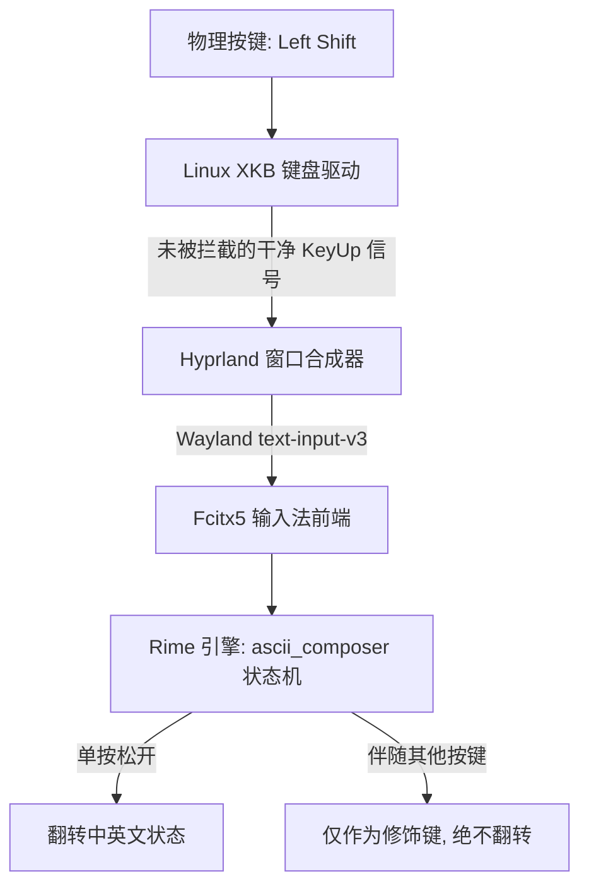

# Linux (Wayland / Hyprland) + Fcitx5 + Rime 中英文切换优化指南
> 打造媲美 Windows 原生输入法的手感：**单按 Shift 松开后切换中英文，长按 Shift 组合键（如输入 `!` 或快捷键）绝不误触发切换**。

---

## 一、背景与核心痛点

在 Linux Wayland（特别是 Hyprland）环境下使用 Fcitx5 + Rime（如雾凇拼音 `rime-ice`）时，常遇到以下体验痛点：

1. **按住即触发（KeyDown 误判）**：
   在输入 `Shift + 1`（感叹号）或 `Shift + 字母` 时，刚按下去就切换了中英文，导致感叹号中英文混杂（如 `!！！！`）。
2. **物理键盘按 Shift 毫无反应**：
   在配置了 Rime 的 Shift 切换后，模拟按键生效，但真实物理键盘单按 Shift 却没有任何响应（KeyUp 信号在驱动层被吞）。
3. **终端锁死纯英文模式**：
   试图为终端配置默认英文输入时，因误用 `app_options` 导致应用聚焦后彻底无法切回中文。
4. **自定义配置未生效**：
   修改了全局 `default.custom.yaml`，但独立方案（如 `rime_ice`）未继承，且未重新编译二进制 Schema。

---

## 二、架构原理与优化链路

要实现 Windows 原生输入法的体验，输入事件必须顺畅穿透三层架构：



* **XKB 驱动层**：必须移除对 Shift 释放事件的截获规则（如 `both_capslock_cancel`）。
* **Fcitx5 框架层**：输入法保持激活，将修饰键检测委托给 Rime 引擎。
* **Rime 状态机层**：采用 `ascii_composer/switch_key` 原生状态机，严禁在 `key_binder` 中监听 Shift。

---

## 三、分步配置操作

### 步骤 1：Hyprland 键盘驱动层（放行 Shift 松开事件）

> [!IMPORTANT]
> 很多 Linux 系统（如 Omarchy）默认在 XKB 中启用了 `shift:both_capslock_cancel`。该规则会让系统驱动拦截单按 Shift 的释放（KeyUp）事件用于取消大写锁定，导致输入法永远收不到“松开”信号。

#### 操作：
编辑 Hyprland 键盘配置文件：
* **Omarchy / Lua 配置路径**：`~/.config/hypr/input.lua`
* **标准 Hyprland 配置路径**：`~/.config/hypr/hyprland.conf`

**如果使用 Lua 格式（`~/.config/hypr/input.lua`）**：
```lua
hl.config({
  input = {
    follow_mouse = 0,
    -- 必须移除 shift:both_capslock_cancel
    kb_options = "compose:caps",
  },
})
```

**如果使用标准 Conf 格式（`~/.config/hypr/hyprland.conf`）**：
```ini
input {
    # 确保 kb_options 中不包含 shift:both_capslock_cancel
    kb_options = compose:caps
}
```

#### 生效命令：
```bash
hyprctl reload config-only
```

---

### 步骤 2：Rime 状态机配置（按键松开切换 + 标点统一）

> [!WARNING]
> 切勿在 `key_binder/bindings` 中配置 `accept: Shift_L, toggle: ascii_mode`！`key_binder` 是按键按下（KeyDown）即刻触发，必然导致打感叹号时误切换。

必须使用 Rime 原生的修饰键状态机（`ascii_composer/switch_key`）。

#### 操作：
1. **针对全局方案**，创建或修改 `~/.local/share/fcitx5/rime/default.custom.yaml`：
```yaml
patch:
  # 方案列表（根据自己安装的方案配置）
  schema_list:
    - schema: rime_ice           # 雾凇拼音（优先）
    - schema: luna_pinyin        # 明月拼音

  # 原生修饰键状态机：单独按下并松开 Shift 才切换；长按组合键不误切
  "ascii_composer/switch_key/Shift_L": commit_code
  "ascii_composer/switch_key/Shift_R": commit_code

  # 统一全半角感叹号，避免中英状态下输入符号不一致
  "punctuator/half_shape/!": "!"
  "punctuator/full_shape/!": "!"
```

2. **针对特定方案（如雾凇拼音）**，创建或修改 `~/.local/share/fcitx5/rime/rime_ice.custom.yaml`：
```yaml
patch:
  # 独立 schema 必须显式 patch 状态机
  "ascii_composer/switch_key/Shift_L": commit_code
  "ascii_composer/switch_key/Shift_R": commit_code

  # 统一感叹号为英文半角 !
  "punctuator/half_shape/!": "!"
  "punctuator/full_shape/!": "!"
```

> [!NOTE]
> `commit_code` 的作用是：在切换到英文模式时，如果有正在输入的拼音未提交，会将拼音字母直接上屏并切为英文。

---

### 步骤 3：终端默认英文配置（程序状态隔离 + 终端初始 Hook）

在 Wayland 下，由于客户端窗口异步创建，Fcitx5 的输入状态容易在窗口间被动继承（例如浏览器处于中文模式时，新开终端也会继承中文）。要实现“**无论其他窗口当前是中是英，新开终端永远 100% 默认英文，且在终端内单按 Shift 随时切回中文**”，需要配合以下两项配置：

#### 1. Fcitx5 状态隔离：按程序独立记忆状态
编辑 `~/.config/fcitx5/config` 中的 `[Behavior]` 区块：
```ini
[Behavior]
# 将共享输入法状态设置为按程序隔离（Program）
# 浏览器保持中文，终端保持英文，互不干扰污染
ShareInputState=Program
```

#### 2. Shell 终端自初始化 Hook（关键保证）
在用户的 `~/.bashrc` 末尾添加以下轻量 Hook（仅在图形交互终端启动时异步通知 Rime 初始化为英文，耗时 0ms，绝不影响终端启动速度）：
```bash
# 终端交互式会话启动时默认进入英文输入状态（按 Shift 可随时切回中文）
if [[ $- == *i* ]] && [ -t 0 ] && [ -n "$WAYLAND_DISPLAY$DISPLAY" ]; then
    (gdbus call --session --dest org.fcitx.Fcitx5 --object-path /rime --method org.fcitx.Fcitx.Rime1.SetAsciiMode true >/dev/null 2>&1 &)
fi
```

#### 3. Fcitx5 前端应用表（可选冗余保障）
维护 `~/.local/share/fcitx5/rime/fcitx5.yaml`：
```yaml
config_version: "0.22"

app_options:
  foot:
    ascii_mode: true
  footclient:
    ascii_mode: true
  WindTerm:
    ascii_mode: true
  windterm:
    ascii_mode: true
  alacritty:
    ascii_mode: true
  kitty:
    ascii_mode: true
  ghostty:
    ascii_mode: true
```
同步到编译目录：
```bash
cp ~/.local/share/fcitx5/rime/fcitx5.yaml ~/.local/share/fcitx5/rime/build/fcitx5.yaml
```

---

### 步骤 4：重新编译部署并重启服务

修改 Yaml 配置文件后，必须重新编译生成 Rime 二进制 Schema 缓存，否则修改完全不会生效。

#### 执行以下命令：
```bash
# 1. 编译部署 Rime 配置
rime_deployer --build ~/.local/share/fcitx5/rime /usr/share/rime-data ~/.local/share/fcitx5/rime/build

# 2. 重启 Fcitx5 服务（如为 systemd 管理）
systemctl --user restart omarchy-fcitx5.service

# 若为独立进程运行，可使用：
# killall fcitx5 && fcitx5 -d
```

---

## 四、排查与避坑指南 (FAQ)

### 1. 为什么不能在 schema / default.custom.yaml 中写 app_options？
* **避坑警告**：如果把 `app_options` 写进 `default.custom.yaml` 或 `rime_ice.custom.yaml`，Rime 引擎层会将该应用程序硬性锁定在 ASCII 模式，导致用户按 Shift 无法切换中文。
* **正确做法**：必须写在 **`fcitx5.yaml`** 中。`fcitx5.yaml` 由 Fcitx5 前端接管，仅在窗口会话创建时将初始状态置为英文（`ascii_mode: true`），完全不影响后续通过 Shift 键自由切换中英文！

### 2. 为什么在浏览器里按 Shift 经常感觉“没反应”？
* **Wayland 焦点机制**：
  Wayland 下输入法仅在应用发送了 `focus: 1` 且激活了可编辑文本框（如 `<input>`、`<textarea>` 或终端提示符光标）时才介入键盘事件。
* 如果鼠标点击了浏览器网页的空白背景，Fcitx5 处于未激活状态（`focus: 0`），此时按任何修饰键均不会有输入法逻辑响应。这是正常机制。

### 3. 如何验证当前系统的物理键盘配置？
在终端中执行：
```bash
hyprctl getoption input:kb_options
```
确保输出中**不包含** `shift:both_capslock_cancel`。

### 4. 为什么引入 keyboard-us 降级布局后必须配置 ActiveByDefault=True 与 TriggerKeys？
* **状态机断裂隐患**：当 Fcitx5 的 profile 中同时配置了 `rime` 与 `keyboard-us` 时，如果未在 `~/.config/fcitx5/config` 中启用 `ActiveByDefault=True`，新窗口或新启动的应用会默认处于“未激活”（即 `keyboard-us` 纯英文状态）。
* 在 `keyboard-us` 状态下，按键直接由系统 XKB 处理，Shift 键根本不会传递给 Rime 状态机。若此时 `TriggerKeys` 为空，用户将既无法通过 Shift 切中文，也无法通过快捷键激活输入法，导致被锁死在纯英文。
* 因此，`ActiveByDefault=True` 与 `[Hotkey/TriggerKeys] 0=Control+space` 是闭环逻辑的绝对前提。

---

## 五、完整验证检查清单

完成配置后，在终端或任意文本框内进行测试：

- [ ] **中文输入测试**：敲击 `ceshi` + 空格，确认能够正常弹出候选框并输出汉字 `测试`。
- [ ] **单按松开切换**：按下左 Shift 并松开，然后敲击 `hello` + 回车，确认输出纯英文 `hello`。
- [ ] **长按组合键测试**：按住 Shift 连续敲击数字 `1` 键，确认输出纯英文半角感叹号 `!!!`，且松开 Shift 后输入法**未被误切**。
- [ ] **单按松开切回**：再次按下左 Shift 并松开，敲击 `nihao` + 空格，确认无缝切回中文并输出 `你好`。
