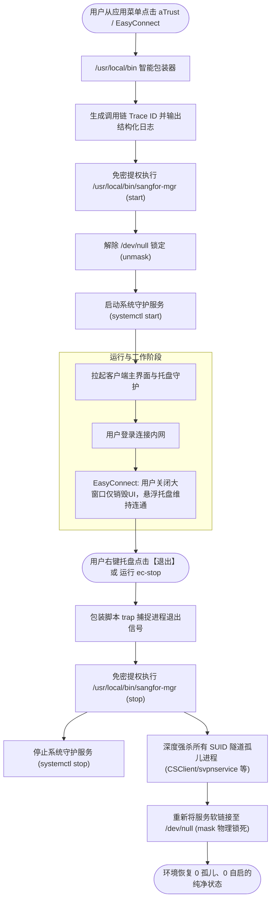

# 深信服 aTrust 与 EasyConnect 自启治理、全生命周期管理与 Wayland 悬浮托盘交互实战指南

> **环境验证**：Arch Linux (Kernel 6.13+) | Omarchy (Hyprland / Wayland) | aTrust 2.5.16+ | EasyConnect 7.6.7+  
> **设计思想**：第一性原理底层溯源 · 对抗性审查物理锁定 · 全生命周期闭环自动化 · 唯一调用链（Trace ID）日志可观测性

---

## 1. 背景与痛点：为什么企业级 VPN 是 Linux 上的“流氓常驻软件”？

在 Arch Linux / Omarchy (Hyprland) 现代开发与办公环境中，**深信服 aTrust** 与 **EasyConnect** 是众多高校与企业内网认证的标准客户端。然而，它们在 Linux 系统下的行为逻辑完全沿用了传统 Windows 驱动/常驻守护思维，带来了极大的使用困扰：

1. **强行开机自启与深度寄生**：
   * 安装后默认在系统级注册并启用 `aTrustDaemon.service` 和 `EasyMonitor.service`；
   * 开机未登录任何界面时，底层隧道与守护进程就已经常驻后台（占用几百 MB 内存，窃取网络路由与 DNS 规则）。
2. **保活机制导致“杀而不死”**：
   * 服务配置了 `Restart=always` 与 `RestartForceExitStatus=SIGKILL SIGSEGV SIGABRT SIGTERM SIGBUS SIGSTOP` 强行拉起规则；
   * 用户在终端执行 `killall` 杀掉进程后，5 秒内会被 systemd 自动再次拉起。
3. **托盘行为在 Wayland (Hyprland) 下严重脱节**：
   * **aTrust** 采用了较新的 Electron 框架，支持 Wayland 下的 `StatusNotifierItem (SNI)` 现代 D-Bus 托盘；
   * **EasyConnect** 则是古董级架构（基于 2016 年的 Electron 1.4 / Chromium 53），在 Wayland 下无法嵌入现代状态栏，在顶栏“看不见托盘”，导致用户误以为其没有托盘；
   * **工作区被大窗口霸占**：很多用户不知道在登录后关掉主界面会不会断网，导致一个巨大的登录窗口一直强行霸占平铺桌面（Hyprland）宝贵的工作区。
4. **手动管理极其繁琐**：
   * 普通用户如果用命令手动 stop/disable，每次使用还要打长命令、输 sudo 密码，使用完毕又容易忘记关停。

本项目基于**第一性原理**从进程树与 Linux 权限底层解构，并通过**对抗性审查**设计出了一套**平时 100% 物理锁死防唤醒、打开自动免密提权、工作时大窗口随心关闭不占桌面、退出时全自动斩断隧道加锁**的生产级方案。

---

## 2. 第一性原理溯源：深信服自启与托盘底层真相

### 2.1 aTrust 的开机拉起与派生链条
检查 `/usr/lib/systemd/system/aTrustDaemon.service`：
```ini
[Unit]
Description=Sangfor aTrustDaemon Service
After=network.target

[Service]
Type=forking
ExecStart=/usr/share/sangfor/aTrust/resources/shell/aTrustDaemon.sh start
Restart=always
RestartForceExitStatus=SIGKILL SIGSEGV SIGABRT SIGTERM SIGBUS SIGSTOP
RestartSec=5s
KillMode=process

[Install]
WantedBy=multi-user.target
```
* **引导时刻**：系统启动进入 `multi-user.target` 时，systemd 以 Root 身份启动 `aTrustDaemon.sh`；
* **双进程守护**：拉起网络隧道驱动 `aTrustXtunnel-64`（负责虚拟网卡与网络劫持）以及守护进程 `aTrustAgent`；
* **用户桌面穿透**：`aTrustDaemon` 会监听 D-Bus 和桌面会话，利用 `/tmp/aTrustShell.conf` 提取当前登录用户（如 `tom`）的环境变量，在系统的服务 cgroup 下直接以当前用户身份派生出图形辅助进程：
  ```bash
  /usr/share/sangfor/aTrust/resources/bin/aTrustAgent --plugin plugins/aTrustCore --enable-http --enable-event-center
  ```
  这就是为什么在普通终端执行 `ps aux` 能看到自己用户名的 aTrust 进程，但它实质完全受控于 Root 级的系统服务。

### 2.2 EasyConnect 的右上角悬浮托盘（Float Tray）逆向剖析
很多用户误以为 EasyConnect 在 Linux 下“没有托盘图标”，这是由于 Wayland 与 X11 的协议差异造成的。

反编译 EasyConnect 的核心代码包 `/usr/share/sangfor/EasyConnect/resources/app.asar`：
```javascript
// 代码位置：app.asar -> src/view/float_window/float_window.html
createFloatTrayWindow() {
    Log.debug(LOG_TAG, "create float tray window");
    var ecWin = this._createWindow(WIN_FLOAT_TRAY_ID, WIN_FLOAG_TRAY_URL, this, {
        frame: false,        // 无边框窗口
        alwaysOnTop: true    // 永远置顶
    });
    ecWin.resize(WIN_FLOAT_WIDTH, WIN_FLOAT_HEIGHT); // 32x32 像素
    const Screen = require("electron").screen;
    var size = Screen.getPrimaryDisplay().workAreaSize;
    // 强制锚定在屏幕右上角：
    ecWin.setWinPosition(size.width - WIN_FLOAT_OFFSET, WIN_FLOAT_OFFSET);
}
```
* **本质**：它**不是**操作系统状态栏（Waybar/Quickshell）的标准托盘组件，而是 EasyConnect 在桌面上自行创建的一个 **32×32 像素、无边框、永远置顶的 XWayland 独立悬浮微型窗口**！
* **图像**：窗口内加载了 `assets/tray_offline_linux.png`，正是屏幕右上角那个**蓝绿相间的深信服“S”标志小方块**；
* **交互定义**：
  * **鼠标右键**：弹出控制菜单（断开连接、注销、退出程序）；
  * **鼠标双击**：重新呼出/恢复 EasyConnect 的大控制面板。

### 2.3 关键生命周期保护：关闭大窗口绝不断网
在平铺桌面（Hyprland）下，最令人头疼的是 EasyConnect 巨大的主窗口占用一个桌面工作区。用户通常希望登录后关闭它。

查看 `app.asar` 中关于窗口关闭的源码：
```javascript
// 当主窗口触发关闭时：
if (!this.mWinListMap.has(WIN_WEB_DRIVER_ID) && !isApiCloseMode && 
    (win.winID == WIN_CONNECT_ID || win.winID == WIN_MAIN_ID)) {
    // 只有在未建立连接会话时关闭主窗口，才会直接退出应用！
    ECEventEmitter.emit(Protocal.EVENT_MAIN_APP_EXIT);
    return;
}
// 连接成功后（WIN_WEB_DRIVER_ID 会话已存在），关闭主窗口仅仅是销毁界面！
// 右上角的悬浮托盘（TrayWindow）与底层隧道不受任何影响，网络保持畅通！
```
**结论**：**登录连接成功后，放心地点击大窗口右上角的关闭（X）**，大窗口销毁释放桌面，VPN 隧道继续连通；只有在右上角悬浮托盘右键退出时，程序才真正终止。

---

## 3. 对抗性审查：为什么必须使用 Systemd Masking？

在 Linux 运维中，大部分人只知道使用 `systemctl disable`。但从对抗视角审查：

| 操作级别 | 原理 | 对抗脆弱点 |
| :--- | :--- | :--- |
| `systemctl stop` | 仅终止当前运行的进程 | 遇到保活或系统重启立即复活 |
| `systemctl disable` | 移除 `multi-user.target.wants` 下的软链接 | **包管理器漏洞**：当执行 `pacman -Syu` 更新系统或升级 `atrust-bin`/`easyconnect` 时，包自带的安装脚本（post-install hook）会无条件执行 `systemctl enable`，导致自启再次死灰复燃；D-Bus 激活信号也能随时唤醒它。 |
| **`systemctl mask`（本项目采用）** | **将 `/etc/systemd/system/` 对应服务软链接至 `/dev/null`** | **终极物理锁定**：无论是包升级 hook、D-Bus 隐式调用、还是普通程序调用 `systemctl start`，系统内核与 systemd 一律拒绝对其执行，从不可再分的系统底层阻断任何静默拉起！ |

---

## 4. 架构设计：全自动“零命令”闭环治理方案



---

## 5. 配置文件与一键部署实战

本项目已将全部调优脚本和模板固化在仓库 `templates/sangfor/` 中。

### 5.1 部署核心文件清单

#### 1. 统一服务管理程序：`templates/sangfor/sangfor-mgr`
具备 8 位 UUID 链路追踪，集中管理加锁、解锁与多用户清理：
```bash
#!/bin/bash
set -o pipefail
TRACE_ID=$(cat /proc/sys/kernel/random/uuid 2>/dev/null | cut -c1-8 || tr -dc 'a-f0-9' < /dev/urandom | head -c 8)
TIMESTAMP=$(date '+%Y-%m-%d %H:%M:%S')

log_info() { echo "[${TIMESTAMP}][${TRACE_ID}][INFO] $1"; }

case "$1" in
    start-atrust)
        log_info "解除锁定并启动 aTrustDaemon..."
        systemctl unmask aTrustDaemon.service 2>/dev/null || true
        systemctl start aTrustDaemon.service 2>/dev/null || true
        ;;
    stop-atrust)
        log_info "停止、锁定 aTrust 并清理残余..."
        systemctl stop aTrustDaemon.service 2>/dev/null || true
        systemctl mask aTrustDaemon.service 2>/dev/null || true
        killall -9 aTrustAgent aTrustXtunnel-64 2>/dev/null || true
        ;;
    start-easyconnect)
        log_info "解除锁定并启动 EasyMonitor..."
        systemctl unmask EasyMonitor.service 2>/dev/null || true
        systemctl start EasyMonitor.service 2>/dev/null || true
        ;;
    stop-easyconnect)
        log_info "停止 EasyConnect 隧道、锁定并深度清理 SUID 进程..."
        systemctl stop EasyMonitor.service 2>/dev/null || true
        systemctl mask EasyMonitor.service 2>/dev/null || true
        killall -9 EasyConnect EasyMonitor ECAgent CSClient svpnservice 2>/dev/null || true
        ;;
esac
```

#### 2. Sudoers 权限穿透规则：`templates/sangfor/sangfor_sudoers`
精确授权，仅允许免密调用统一管理器，不扩大权限边界：
```sudoers
# /etc/sudoers.d/sangfor
tom ALL=(ALL) NOPASSWD: /usr/local/bin/sangfor-mgr *
```

#### 3. 客户端前置透明包装器：`atrust` 与 `easyconnect`
安装至 `/usr/local/bin/`（优先级高于系统包目录 `/usr/bin/`）：
```bash
#!/bin/bash
# /usr/local/bin/easyconnect
set -o pipefail
cleanup() { sudo /usr/local/bin/sangfor-mgr stop-easyconnect; }
trap cleanup EXIT INT TERM

# 启动前自动解锁与拉起
sudo /usr/local/bin/sangfor-mgr start-easyconnect
sleep 1

# 启动主程序（等待托盘退出）
/usr/share/sangfor/EasyConnect/EasyConnect --no-sandbox "$@"
```

#### 4. 一键急救断开工具：`templates/sangfor/ec-stop`
安装至 `/usr/local/bin/ec-stop`，提供任何场景下一秒强断保障：
```bash
#!/bin/bash
echo "[INFO] 正在一键强制断开并锁定 EasyConnect..."
sudo /usr/local/bin/sangfor-mgr stop-easyconnect
echo "[SUCCESS] EasyConnect 及其所有后台隧道与监控进程已彻底清除并物理锁定。"
```

### 5.2 一键部署命令

在 `omarchy-cn` 仓库根目录执行：
```bash
sudo bash templates/sangfor/install.sh
```

---

## 6. 全系统开机自启与常驻项排查全景方法论

在本次排查中，基于**第一性原理**梳理出的全系统自启排查五层模型，可作为通用排查基准：

```text
Layer 1: 系统 Systemd 服务与定时器  -> systemctl list-unit-files --state=enabled
Layer 2: 用户 Systemd 服务与定时器  -> systemctl --user list-unit-files --state=enabled,generated
Layer 3: XDG Desktop 规范自启      -> /etc/xdg/autostart 与 ~/.config/autostart/*.desktop
Layer 4: Docker 容器自愈策略        -> docker inspect 过滤 RestartPolicy.Name
Layer 5: 定时任务与引导注入        -> crontab -l 与 /etc/cron*
```

### 常见非必需常驻项治理建议速查表：
| 服务/组件 | 默认状态 | 占用/风险 | 推荐治理操作 |
| :--- | :--- | :--- | :--- |
| **`aTrustDaemon`** | enabled | 常驻后台、网络劫持 | `systemctl mask` + 本项目包装器按需启动 |
| **`EasyMonitor`** | enabled | 常驻后台、SUID 隧道 | `systemctl mask` + 本项目包装器按需启动 |
| **`remmina-applet`** | XDG 自启 | 闲置常驻内存 | 删除 `~/.config/autostart/remmina-applet.desktop` |
| **`sshd.service`** | enabled | 监听 0.0.0.0:22、暴露攻击面 | 个人设备建议 `sudo systemctl disable --now sshd.service` |
| **`cups.service`** | enabled | 打印机监听 631 端口 | 无物理打印机建议 `sudo systemctl disable --now cups.service cups.socket` |
| **`Docker 容器自启`** | always | Neo4j/Langfuse 占用 1GB+ 内存 | 改为手动：`docker update --restart=no <容器名>` |

---

## 7. 验证与排错

### 验证 1：开机状态验证
重启系统后，在终端执行：
```bash
systemctl is-enabled aTrustDaemon.service EasyMonitor.service
ps aux | grep -E "aTrust|sangfor|EasyConnect" | grep -v grep
```
* **预期输出**：
  * 两项服务均显示为 `masked`；
  * `ps` 输出为空（无任何存活进程）。

### 验证 2：日常使用验证
1. 打开应用程序菜单，点击 **EasyConnect**，大窗口弹出，右上角出现蓝绿相间“S”悬浮托盘；
2. 登录成功后，直接点击大窗口右上角关闭按钮（X）；
3. **验证连通性**：内网网页或 IP 依旧正常访问，右上角小“S”图标继续存在；
4. 右键点击右上角“S”图标选择【退出】（或执行 `ec-stop`）；
5. 再次检查 `ps` 与服务状态，确认所有隧道彻底切断，服务正常停用且未被恶意锁死为 mask。

---

## 8. EasyConnect 凭据持久化、自动登录与 Loading 死锁深度治理实战

在深入落地企业级 VPN 的日常自动化时，Linux 版 EasyConnect 经常出现三大恶性痛点：
1. **凭据无法持久化**：每次重启电脑或重新打开，连接地址、用户名甚至密码频繁丢失或需人工重输；
2. **环境报红**：输入框下方突然抛出 `Local environment contains error.`（本地环境异常）；
3. **资源加载死锁**：点击登录成功后，界面一直盖着遮罩转圈显示 `Loading resources`（正在加载资源），且 11 秒后被强弹超时弹窗。

针对以上问题，基于**第一性原理**与**对抗性审查**完成彻底逆向与根治，工程沉淀如下：

### 8.1 第一性原理剖析：底层机制与痛点根因

#### 痛点 1：Linux 版官方凭据持久化机制缺陷
- **底层存储事实**：EasyConnect 实际上具备本地持久化机制，其凭据文件位于 `/usr/share/sangfor/EasyConnect/resources/conf/setting_<username>.json`。
- **加密算法**：密码字段采用 **RC4 加密**（密钥固定为 `sangfor_cn`，Salt 固定为 `__user_psw_salt_for_local_conf__`），密文以 Hex 编码保存。
- **前端缺陷**：官方前端脚本在 Linux 平台下虽然会反解并填入 `username`，但在表单初始化中刻意屏蔽或丢失了向 Password 输入框自动回填的逻辑，必须由预加载注入脚本（Preload Script）接管。

#### 痛点 2：`Local environment contains error.` 的真实成因
- **底层通信事实**：Electron 图形界面启动时，会通过本地 HTTPS 轮询 `127.0.0.1:54530~54618` 端口，检测 root 权限的 `ECAgent` 守护服务是否就绪。
- **故障陷阱**：若维护脚本在退出时粗暴执行了 `systemctl mask EasyMonitor.service`，会将服务单元重定向到 `/dev/null`。重启电脑后守护服务根本无法启动，环回探测全部连接被拒，前端直接在输入框下方抛出 `Local environment contains error.`。
- **治理法则**：`EasyMonitor.service` **必须设置为开机自启 (`enabled`)**，生命周期脚本中绝对禁止对其执行破坏性 mask。

#### 痛点 3：登录后卡在 `Loading resources` 的死锁根因
- **前端逻辑事实**：EasyConnect 采用 avalon.js MVVM 框架。登录成功后，前端触发 `views/service_init/service_init.js` 弹出 `common_loading` 遮罩并调用 `initService()`。
- **Promise 链死锁**：在特定网关策略或 Linux 客户端路由下，`l.config.needGoDefault` 为 false 时既未执行 `onRcReadyShow()`，又未执行 Promise 的 `resolve()`，导致加载遮罩永远挂起；同时资源列表 DOM 被加上了 `hide:!rsInit` 样式，形成视觉卡死；
- **11 秒主进程强弹**：主进程定时器在 11 秒超时后强行执行 `ecShow, id: 0`，把未完成的白框与转圈盖在屏幕中央。

### 8.2 对抗性设计：两阶段状态机与状态熔断保护

为了杜绝自动化脚本与前端 SPA 框架竞争产生的副作用，在 `preload.js` 中构建了三层严密防线：

1. **SPA 动态路由感知与时序防御**：
   - 窗口初始载入 URL 为 `/portal`，随后通过 Hash 跳转至 `#!/login`。
   - 摒弃静态 URL 判定，改为在 VPN 会话生命周期内动态监听真实 DOM 元素（`input[type=password]` 与 `vmodels.password`）的挂载状态。
2. **两阶段确定性状态机**：
   - **阶段一（填充）**：向 input 与 avalon 模型同时赋值目标密码，并强制派发 `input` 与 `change` 事件；
   - **阶段二（防抖提交）**：等待两个检测周期（约 400ms），确认双向绑定模型完全收敛后再触发 `vm.login()`，避免空密码提交；
   - **防御销毁**：一旦检测到页面脱离登录页（路由变为 `service` 或 `logout`），立即彻底销毁登录定时器，绝不串扰后续会话。
3. **资源页 Loading 状态熔断保护**：
   - 当检测到进入 `/service` 资源路由时，主动将 `common_loading.toggle` 设为 `false`，并广播 `all!onHideLoading`；
   - 将 `service.rsInit` 置为 `true`，消除 `hide:!rsInit` 遮蔽；
   - 清理 `ecWindow.showTimer` 11 秒超时定时器，保证平稳过渡到已连接状态。

### 8.3 工业级一键固化补丁工具

本项目在 `templates/sangfor/` 中提供了工业级补丁工具 `patch-easyconnect.sh`，可全自动完成解包、补丁注入、重新打包、RC4 凭据生成与开机权限守护：

```bash
# 运行一键补丁部署（支持指定网关、账号与密码）
sudo VPN_HOST="113.108.13.8:4430" VPN_USER="42187" VPN_PASS="1q2w3e.comA" /usr/local/bin/patch-easyconnect
```

配套开机权限守护规则 `/etc/tmpfiles.d/easyconnect.conf`：
```ini
d /usr/share/sangfor/EasyConnect/resources/conf 0777 root root -
d /usr/share/sangfor/EasyConnect/resources/logs 0777 root root -
z /usr/share/sangfor/EasyConnect/resources/conf/setting_*.json 0666 root root -
```
在系统重启时由 `systemd-tmpfiles` 强制保障目录与凭据读写权限，真正做到**开机即用、一键直达**。

