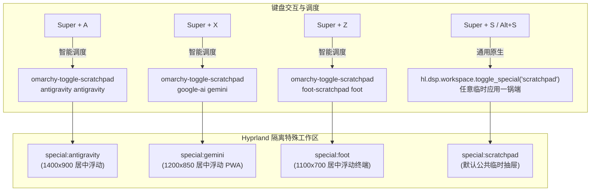

# Omarchy 独立应用专属弹出与隐藏配置指南（Hyprland 具名特殊工作区、通用 Scratchpad 双轨制与智能拉起守护）

> **适用环境**：Omarchy (Arch Linux + Hyprland on Wayland)  
> **面向用户**：追求极致键盘流呼出/隐藏、高频调用 AI/开发工具/轻量终端的技术开发者与重度桌面玩家  
> **核心收益**：理解 Hyprland 特殊工作区机制；摆脱多应用混挤同一个 Scratchpad 的“一锅端”困局；构建专属独立弹出通道（如 `Super + A` 呼出 Antigravity、`Super + X` 独立呼出 Google AI、`Super + Z` 呼出专属终端）；同时完美保留 `Super + Alt + S` 与 `Super + S` 作为任意应用的通用临时抽屉。

---

## 一、背景与核心痛点

在 Omarchy 桌面系统中，官方预设了非常优雅的暂存工作区（Scratchpad）机制：
* `Super + Alt + S`：将当前聚焦的窗口送入后台特殊工作区（`special:scratchpad`）；
* `Super + S`：一键在当前屏幕中央弹出或隐藏该特殊工作区。

然而在日常深度开发与高频办公中，用户常常遇到以下痛点：

1. **“一锅端”互斥冲突**：
   由于默认所有被暂存的应用都共享名为 `scratchpad` 的公共空间，当用户暂存了微信、终端、计算器和网页后，按下 `Super + S` 会将它们**全部一次性弹出来**，无法对特定应用（如专属 AI 工具或控制台）实现单独精确召回与隐藏；
2. **缺乏独立应用的专属快捷键直达**：
   核心高频应用（例如 Antigravity IDE、Google AI 独立客户端、便签终端）用户希望拥有专属的单键呼出（如 `Super + A`、`Super + X`、`Super + Z`），做到“想用就弹，用完即匿”；
3. **窗口未启动与跨工作区迷航**：
   常规快捷键仅支持 `togglespecialworkspace`，如果应用尚未启动，按快捷键屏幕毫无反应；如果应用此前已经被打开在普通平铺工作区，单纯调用切换也不会自动将其拉到当前屏幕居中。

---

## 二、架构原理：Hyprland 具名特殊工作区与双轨制

### 1. 具名特殊工作区（Named Special Workspaces）

Hyprland 允许创建无限个独立的特殊工作区，格式为 `special:<工作区标识>`。每个特殊工作区拥有完全隔离的生命周期与窗口堆叠树：



### 2. 双轨制架构设计

| 维度 | 独立专属抽屉 (Dedicated Scratchpad) | 通用临时抽屉 (Universal Scratchpad) |
| :--- | :--- | :--- |
| **工作区标识** | `special:antigravity`、`special:gemini`、`special:foot` 等 | 官方默认 `special:scratchpad` |
| **快捷键设计** | **单键直达**：`Super + A`、`Super + X`、`Super + Z` | **组合管理**：`Super + Alt + S` 存入，`Super + S` 呼出 |
| **目标应用类型**| 超高频专用软件（AI 问答、专用终端、IDE、音乐播放器） | 任意临时想丢后台的窗口（聊天弹窗、下载任务、系统监视器） |
| **自动化程度** | 启动自动进专属后台；进程未运行时按键自动拉起 | 手动随心存取 |

---

## 三、工程落地与配置实操

### 1. 部署智能调度辅助脚本：`omarchy-toggle-scratchpad`

为了避免复杂的单行 Shell 转义并实现**“未启动则启动入驻、在其他工作区则自动规整归位、已就绪则丝滑切换弹出/隐藏”**，在 `~/.local/bin/omarchy-toggle-scratchpad` 编写轻量调度器：

```bash
#!/bin/bash
# =================================================================
# Omarchy 独立专属应用 Scratchpad 调度助手
# 语法: omarchy-toggle-scratchpad <class-pattern> <special-name> <launch-cmd>
# =================================================================

CLASS_PAT="$1"
SP_NAME="$2"
shift 2
LAUNCH_CMD="$*"

if [ -z "$CLASS_PAT" ] || [ -z "$SP_NAME" ]; then
  echo "Usage: omarchy-toggle-scratchpad <class-pattern> <special-name> <launch-command>"
  exit 1
fi

# 严格边界保护：若未显式指定正则起止符，则默认严格全字匹配 ^...$
# 彻底防止 "antigravity" 贪婪匹配到 "antigravity-ide" 等衍生窗口
if [[ "$CLASS_PAT" != ^* ]] && [[ "$CLASS_PAT" != *\$ ]]; then
  REGEX="^${CLASS_PAT}$"
else
  REGEX="$CLASS_PAT"
fi

# 1. 探测目标窗口地址（精确匹配 class）
ADDR=$(hyprctl clients -j | jq -r --arg p "$REGEX" '.[] | select(.class | test($p; "i")) | .address' | head -n1)

if [ -z "$ADDR" ]; then
  # 窗口不存在：拉起启动命令，并在窗口初始化后呼出对应工作区
  if [ -n "$LAUNCH_CMD" ]; then
    eval "$LAUNCH_CMD &"
    sleep 0.4
    hyprctl dispatch "hl.dsp.workspace.toggle_special(\"$SP_NAME\")" >/dev/null 2>&1 || hyprctl dispatch togglespecialworkspace "$SP_NAME"
  fi
else
  # 窗口已存在：检查当前所在工作区，若不在专属 special 则先移入归位
  CUR_WS=$(hyprctl clients -j | jq -r --arg a "$ADDR" '.[] | select(.address == $a) | .workspace.name')
  if [ "$CUR_WS" != "special:$SP_NAME" ]; then
    hyprctl dispatch "hl.dsp.window.move({ workspace = \"special:$SP_NAME\", window = \"address:$ADDR\", follow = false })" >/dev/null 2>&1
  fi
  # 切换弹出/隐藏状态
  hyprctl dispatch "hl.dsp.workspace.toggle_special(\"$SP_NAME\")" >/dev/null 2>&1 || hyprctl dispatch togglespecialworkspace "$SP_NAME"
fi
```

赋予执行权限：
```bash
chmod +x ~/.local/bin/omarchy-toggle-scratchpad
```

---

### 2. 配置窗口静默入驻与居中规则：`~/.config/hypr/windowrules.lua`

在窗口规则中加入各专属应用的静默进入规则，确保窗口打开时**不会打扰当前屏幕平铺结构**，并在呼出时保持统一舒适的高清居中比例：

```lua
-- =================================================================
-- 专属单应用独立弹出 (Scratchpad) 规则
-- =================================================================

-- 1. Antigravity: 自动静默送入 special:antigravity，大尺寸浮动居中
o.window("^antigravity$", {
  workspace = "special:antigravity silent",
  float = true,
  center = true,
  size = { 1400, 900 },
})

-- 2. Google AI (Gemini 独立 WebApp): 自动静默送入 special:gemini
o.window("^(chrome-gemini.*|google-ai)$", {
  workspace = "special:gemini silent",
  float = true,
  center = true,
  size = { 1200, 850 },
})

-- 3. Foot 专属下拉终端: 自动静默送入 special:foot
o.window("^foot-scratchpad$", {
  workspace = "special:foot silent",
  float = true,
  center = true,
  size = { 1100, 700 },
})
```

---

### 3. 配置按键拓扑与解绑：`~/.config/hypr/bindings.lua`

> [!IMPORTANT]
> **快捷键占用避坑**：
> * `SUPER + A`：若原配置中有普通启动绑定，需先调用 `hl.unbind("SUPER + A")`。
> * `SUPER + X`：被系统默认占用为 `Universal cut`（通用剪切）。Linux 用户统一使用 `Ctrl + X` 剪切，必须先 `hl.unbind("SUPER + X")` 释放。
> * `SUPER + Z`：系统原生空闲，可直接绑定。
> * **切勿解绑或覆盖 `SUPER + S` 与 `SUPER + ALT + S`**，以保证通用模式继续无损运行！

编辑 `~/.config/hypr/bindings.lua`：

```lua
-- =================================================================
-- 核心独立弹出/隐藏 Scratchpad 应用绑定（通用模式保持默认 SUPER+S / SUPER+ALT+S）
-- =================================================================

-- 1. Antigravity 开发主站 (Super + A)
hl.unbind("SUPER + A")
o.bind("SUPER + A", "Toggle Antigravity", "omarchy-toggle-scratchpad '^antigravity$' antigravity 'uwsm-app -- antigravity'")

-- 2. Google AI 独立无边框应用 (Super + X)
hl.unbind("SUPER + X")
o.bind("SUPER + X", "Toggle Google AI", "omarchy-toggle-scratchpad '(chrome-gemini|google-ai)' gemini 'omarchy-launch-webapp https://gemini.google.com'")

-- 3. Foot 专属下拉便签终端 (Super + Z)
o.bind("SUPER + Z", "Toggle Foot Terminal", "omarchy-toggle-scratchpad foot-scratchpad foot 'uwsm-app -- foot --app-id=foot-scratchpad'")
```

---

## 四、关键避坑与核心要点

### 1. 独立应用与浏览器的隔离（不走浏览器）
许多用户希望 Google AI 等 Web 应用作为独立程序常驻，而不是混在拥挤的浏览器标签页中。
通过 Omarchy 的 `omarchy-launch-webapp https://gemini.google.com` 启动，底层会为 Chromium 传入 `--app=https://gemini.google.com` 参数：
* 剔除所有标签栏、URL 地址栏和扩展工具栏；
* 生成独立的窗口 Class（如 `chrome-gemini.google.com__-Default`）；
* 拥有完全独立的生命周期，关掉浏览器主窗口也不会影响该 AI 窗口常驻。

### 2. 专用终端与日常开发终端的隔离
如果直接给 `foot` 设置 `special:foot silent` 规则，会导致你平时在平铺工作区按 `Super + Return` 新开的所有普通 Foot 终端全被抓进后台特殊工作区！
* **解决方案**：在弹出脚本中使用 `foot --app-id=foot-scratchpad` 启动；
* 规则只针对 `foot-scratchpad` 生效，平铺开发区使用的标准 `foot` 绝不受到任何波及。

### 3. 同名前缀窗口隔离（Antigravity 与 Antigravity IDE）
在真实开发环境中，用户经常同时打开：
* **Antigravity**（对话客户端，Class 为 `antigravity`）
* **Antigravity IDE**（代码编辑器工作台，Class 为 `antigravity-ide`）

> [!CAUTION]
> 若在匹配 Class 时使用裸正则（如 jq `test("antigravity")`），由于 `antigravity-ide` 包含了 `antigravity` 这一子串，会导致脚本在探测窗口时**错误地将编辑器窗口 `antigravity-ide` 抓入特殊工作区**，造成按 `Super + A` 时两者捆绑弹出的怪异现象！
> 
> **解决之道**：
> 1. 调度脚本 `omarchy-toggle-scratchpad` 内置严格的起止边界检查（自动补全 `^...$`）；
> 2. 在绑定快捷键时，传入显式锚定模式 `'^antigravity$'`；
> 3. 确保 `antigravity-ide` 保持平铺在主常规工作区（如 Workspace 1 / 3），永不被特殊工作区波及。


---

## 五、验证与检查清单

执行配置重载：
```bash
hyprctl reload
```

验证快捷键注册情况：
```bash
omarchy menu keybindings --print | grep -E "(SUPER \+ [AXZS]|SUPER ALT \+ S)"
```

预期标准输出：
```text
SUPER + Z                           → Toggle Foot Terminal
SUPER + A                           → Toggle Antigravity
SUPER + X                           → Toggle Google AI
SUPER + S                           → Toggle scratchpad
SUPER ALT + S                       → Move window to scratchpad
```

测试验证流程：
1. 按下 `Super + A`：Antigravity 弹出并居中；再次按下 `Super + A`，平滑隐藏；
2. 按下 `Super + X`：Gemini 独立无框应用弹出；再次按下，平滑隐藏；
3. 按下 `Super + Z`：Foot 专属终端就地弹出；
4. 聚焦到任意普通软件（如微信、计算器），按下 `Super + Alt + S` 存入公共抽屉，按下 `Super + S` 验证通用批量弹出/隐藏功能完好如初。
