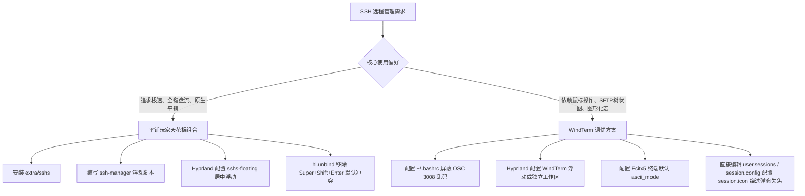

# Omarchy 下 SSH 高效运维方案选型（平铺天花板 TUI 组合与 WindTerm 避坑深度指南）

在 Arch Linux + Hyprland（Omarchy）平铺式 Wayland 桌面环境下，系统运维与远程连接是日常开发的核心场景。然而，平铺桌面独特的**全键盘驱动**与**窗口动态分屏**特性，与传统的图形化多标签终端产生了强烈的理念冲突。

本文全面复盘 Omarchy 环境下的两套主流 SSH 运维方案：
1. **平铺玩家天花板组合**：Foot 原生 Wayland 极速终端 + `sshs` 纯文本会话管理器 + Spotlight 浮动弹窗 + 全局热键；
2. **WindTerm 全功能图形方案**：多合一 IDE 级终端的深度适配、Hyprland 窗口规则、**致命的 systemd OSC 3008 提示符乱码底层排查与修复**，以及 **XWayland 下弹窗指针抓取（Pointer Grab）失效与会话图标配置文件一键修改**。

---

## 目录

- [一、 方案选型与设计哲学对比](#一-方案选型与设计哲学对比)
- [二、 平铺玩家天花板组合（原生 Wayland TUI + 标准化工具链）](#二-平铺玩家天花板组合原生-wayland-tui--标准化工具链)
  - [2.1 架构设计与技术栈](#21-架构设计与技术栈)
  - [2.2 核心组件一：安装与配置 sshs 会话管理器](#22-核心组件一安装与配置-sshs-会话管理器)
  - [2.3 核心组件二：构建专属极速浮动启动脚本](#23-核心组件二构建专属极速浮动启动脚本)
  - [2.4 核心组件三：Hyprland 居中浮动窗口规则](#24-核心组件三hyprland-居中浮动窗口规则)
  - [2.5 核心组件四：全局快捷键注册与 Omarchy 冲突避坑（hl.unbind 关键点）](#25-核心组件四全局快捷键注册与-omarchy-冲突避坑hlunbind-关键点)
  - [2.6 配套方案：远程文件浏览、传输与挂载（Yazi / Rsync / SSHFS）](#26-配套方案远程文件浏览传输与挂载yazi--rsync--sshfs)
- [三、 WindTerm 深度适配与避坑指南](#三-windterm-深度适配与避坑指南)
  - [3.1 WindTerm 在平铺 Wayland 下的痛点剖析](#31-windterm-在平铺-wayland-下的痛点剖析)
  - [3.2 致命问题排查：systemd OSC 3008 提示符乱码与控制字符溢出](#32-致命问题排查systemd-osc-3008-提示符乱码与控制字符溢出)
  - [3.3 优雅修复：~/.bashrc 细粒度环境检测与转义屏蔽](#33-优雅修复bashrc-细粒度环境检测与转义屏蔽)
  - [3.4 Hyprland 专属浮动窗口与工作区隔离规则](#34-hyprland-专属浮动窗口与工作区隔离规则)
  - [3.5 Fcitx5 输入法纯英文锁定配置](#35-fcitx5-输入法纯英文锁定配置)
  - [3.6 交互避坑：XWayland 下拉选择框指针抓取（Pointer Grab）失效与会话图标配置文件直修](#36-交互避坑xwayland-下拉选择框指针抓取pointer-grab失效与会话图标配置文件直修)
- [四、 方案决策矩阵与总结建议](#四-方案决策矩阵与总结建议)

---

## 一、 方案选型与设计哲学对比

| 维度 | 平铺玩家天花板组合 (Foot + sshs + OpenSSH) | WindTerm 全功能方案 (Qt + XWayland) |
| :--- | :--- | :--- |
| **设计哲学** | **Unix 组合律**：小工具组合，各司其职，无缝融入系统 | **一体化 IDE**：Session 树、SFTP 文件树、命令宏全部集成 |
| **启动性能** | **毫秒级 (< 10ms)**，内存占用 < 15MB | **秒级 (1~3s)**，静态内存占用 150MB~300MB |
| **窗口交互** | 全局快捷键呼出 **Spotlight 浮动弹窗**，回车直达新平铺窗口 | 软件自身包含多层内置切分面板，被 Hyprland 平铺后极度局促 |
| **配置通用性** | **100% 标准 `~/.ssh/config`**，明文可 Git 管理，随处迁移 | 依赖内部自定义会话文件与私有配置，跨机器同步较繁琐 |
| **Wayland 支持** | **原生纯 Wayland**，HiDPI 完美锐利，零闪烁 | 基于 XWayland 运行，伴随临时下拉弹窗失焦、点击穿透问题 |
| **文件传输** | 命令行管道、`rsync` 极速同步、`yazi` 或 `sshfs` 挂载本地编辑 | 侧边栏图形化 SFTP 树，支持鼠标拖拽上传下载 |
| **适用人群** | **极客、Vim/Neovim 玩家、重度平铺键盘流、追求极简与速度** | **习惯 Windows/Mac 操作逻辑、需要直观鼠标拖拽传文件** |

---

## 二、 平铺玩家天花板组合（原生 Wayland TUI + 标准化工具链）

### 2.1 架构设计与技术栈

该组合的核心理念是：**让管理归管理，让连接归系统，让操作归键盘**。
1. **会话检索**：基于 `sshs`，实时根据 `~/.ssh/config` 模糊搜索主机名、别名、IP 或 Tag；
2. **瞬时呼出**：轻量终端 `foot` 设置特定 `app-id`，作为 Spotlight 居中弹窗展示；
3. **会话生命周期**：选中目标主机按下回车，立即打开正式的 SSH 终端平铺在工作区中，弹窗自动关闭。

```
[ 用户按下 Super + Shift + Enter ]
               │
               ▼
[ Foot 极速唤起 Spotlight 浮动弹窗 (app-id: sshs-floating) ]
               │
               ▼
[ 运行 sshs: 实时模糊匹配 ~/.ssh/config 所有服务器 ]
               │
       (键入关键字并回车)
               │
               ▼
[ Spotlight 窗口销毁，直接在当前或目标工作区建立原生 SSH 会话 ]
```

---

### 2.2 核心组件一：安装与配置 sshs 会话管理器

`sshs` 已经收录在 Arch Linux 官方仓库中：

```bash
sudo pacman -S sshs
```

`sshs` 完全遵循 OpenSSH 规范，它的一切数据均来自标准配置文件 `~/.ssh/config`。你可以为常用机器添加清晰的注释与标签：

```sshconfig
# ~/.ssh/config 示例

# 阿里云生产集群跳板机
Host ali-jump
    HostName 47.98.xxx.xxx
    User root
    Port 22
    IdentityFile ~/.ssh/id_ed25519

# 内部业务节点（通过跳板机代理直连）
Host k8s-master-01
    HostName 192.168.10.101
    User admin
    ProxyJump ali-jump
    IdentityFile ~/.ssh/id_ed25519

# 常用个人测试机
Host dev-homelab
    HostName 192.168.1.200
    User tom
```

`sshs` 会自动提取 `Host` 别名、`HostName` IP、`User` 用户名建立索引，支持 `/` 全文实时模糊检索。

---

### 2.3 核心组件二：构建专属极速浮动启动脚本

为了让终端在打开 `sshs` 时拥有独立的窗口属性（以便 Hyprland 识别为弹窗而非普通平铺终端），编写启动脚本：

创建并赋予可执行权限 `~/.local/bin/ssh-manager`：

```bash
#!/bin/bash
# 启动原生 Wayland foot 终端，指定 app-id 为 sshs-floating
foot --app-id=sshs-floating --title="SSH Sessions" sshs
```

```bash
chmod +x ~/.local/bin/ssh-manager
```

---

### 2.4 核心组件三：Hyprland 居中浮动窗口规则

在 Omarchy 的配置文件 `~/.config/hypr/windowrules.lua` 中追加规则，将 `sshs-floating` 声明为居中浮动窗口：

```lua
-- ~/.config/hypr/windowrules.lua

-- SSH 会话管理器 (sshs) 居中浮动窗口
o.window("sshs-floating", {
  float = true,
  center = true,
  size = { 960, 600 },
})
```

> [!NOTE]
> 在 Omarchy 的 Lua 语法中，`o.window("app_id", { ... })` 会自动映射至底层 Hyprland 的 `windowrulev2`。设置尺寸 `960x600` 并居中，能带来媲美 macOS Raycast / Alfred 的丝滑聚焦质感。

---

### 2.5 核心组件四：全局快捷键注册与 Omarchy 冲突避坑（hl.unbind 关键点）

在 `~/.config/hypr/bindings.lua` 中将 `Super + Shift + Enter` 绑定到该脚本。

> [!CAUTION]
> **避坑关键**：Omarchy 预置系统默认将 `SUPER + SHIFT + RETURN` 绑定到了系统默认浏览器（`browser`）。
> 如果你只执行 `o.bind(...)`，按下快捷键时会**同时启动浏览器和 SSH 管理器**！
> **必须显式使用 `hl.unbind(...)` 解绑系统默认设置**。

修改 `~/.config/hypr/bindings.lua`：

```lua
-- ~/.config/hypr/bindings.lua

-- 先解绑系统默认可能占用的浏览器快捷键
hl.unbind("SUPER + SHIFT + RETURN")

-- 绑定全局 SSH 会话管理器呼出快捷键
o.bind("SUPER + SHIFT + RETURN", "SSH Sessions", { launch = "ssh-manager" })
```

保存后重新加载 Hyprland 配置即可生效：

```bash
hyprctl reload config-only
```

---

### 2.6 配套方案：远程文件浏览、传输与挂载（Yazi / Rsync / SSHFS）

放弃图形化界面的 SFTP 树之后，如何优雅地处理远端文件？

#### 1. 现代 TUI 极速文件管理器：Yazi
安装现代异步终端文件管理器 Yazi：
```bash
sudo pacman -S yazi
```
配合 `yazi-rs` 的 sftp/remote 支持，可以直接在终端内双栏翻阅远程服务器文件，体验远胜传统 GUI。

#### 2. 日常快速同步：标准化 Rsync 别名
在 `~/.bashrc` 中配置安全同步别名：
```bash
alias rpull='rsync -avzP --exclude=".git"'
alias rpush='rsync -avzP --exclude=".git"'
```
利用前面 `~/.ssh/config` 定义的别名，传输文件只需：
```bash
rpush ./dist/ ali-jump:/var/www/html/
```

#### 3. 本地化透明编辑：SSHFS 挂载
直接将远程目录挂载为本地虚拟路径，本地直接用 NeoVim、VS Code、Ripgrep 飞速读写：
```bash
sudo pacman -S sshfs
mkdir -p ~/remote/ali-jump
sshfs ali-jump:/home/admin ~/remote/ali-jump
# 卸载
fusermount -u ~/remote/ali-jump
```

---

## 三、 WindTerm 深度适配与避坑指南

如果日常运维中必须依赖直观的 SFTP 文件拖拽上传、会话历史树状分组以及可视化指令宏，**WindTerm** 是目前 Linux 平台下最强大的跨平台运维利器（采用 C++ 与 Qt 编写，性能大幅优于 Electron 架构的客户端）。

然而，WindTerm 在 Omarchy 这类基于 Wayland + systemd 现代架构的系统中，存在几个严重的开箱问题。

---

### 3.1 WindTerm 在平铺 Wayland 下的痛点剖析

1. **窗口挤压问题**：WindTerm 本身是一个拥有复杂 Docking 系统的 IDE（左侧主机树、右侧终端、底部传输队列与命令宏）。如果直接作为普通平铺窗口打开，会被平铺规则强行切分成狭长视口，内部面板完全折叠无法辨识。
2. **转义序列冲突**：在打开本地 Shell 或 SSH 登录现代 Linux 服务器时，屏幕出现大量类似 `133;A`、`3008;...` 的乱码字符，导致提示符闪烁混乱。
3. **临时弹出菜单/选择框失焦与点击穿透**：编辑会话属性或图标时，下拉选择框（Popup Window）由于 XWayland 与 Wayland 合成器之间的指针抓取冲突，鼠标无法划入甚至穿透失焦。

---

### 3.2 致命问题排查：systemd OSC 3008 提示符乱码与控制字符溢出

#### 1. 故障现象
在 WindTerm 中启动终端会话（无论是本地 bash 还是连接远程服务器），每次按下回车或者执行完命令后，提示符前方都会莫名吐出垃圾字符：
```text
3008;...133;A
tom@archlinux:~$ ls
3008;...133;B
```
并且历史命令在按方向键上下翻页时发生错行和覆盖。

#### 2. 底层根因深度解析
现代 Linux 系统（特别是 Arch Linux 与搭载高版本 systemd 的发行版）引入了 **Shell Integration（终端与 Shell 语义集成）** 机制。
在系统的 `/usr/share/bash/bashrc` 或 systemd 环境变量脚本中，预先注册了一套转义序列钩子：
* **OSC 7**：向终端上报当前工作目录（实现终端新 Tab 继承路径）；
* **OSC 133**：Semantic Prompt 标记（区分命令输入区、命令输出区）；
* **OSC 3008**：systemd 专属上下文跟踪（用于跟踪进程生命周期、退出状态码等）。

这些钩子在 Bash 的 `PS0`、`PROMPT_COMMAND` 以及系统预定义的函数 `__systemd_osc_context_precmdline()` 中被定时触发。

**问题在于**：Foot、Kitty、Ghostty 等现代原生终端已经支持或能无害过滤这些序列，但 **WindTerm 的虚拟终端解析器未能正确捕获 OSC 3008 序列，将其作为未识别的未知 ASCII 字符串，直接倾倒到了用户的终端显示缓冲区中！**

---

### 3.3 优雅修复：~/.bashrc 细粒度环境检测与转义屏蔽

既要彻底干掉 WindTerm 下的乱码，又绝不能破坏 Foot / Kitty 等原生终端已有的 systemd 语义追踪特性，因此必须采用**细粒度环境探测方案**。

检查 WindTerm 启动时注入的特有环境变量：
* `$TERM_PROGRAM` 会被设为 `WindTerm`；
* 或者存在 `$WINDTERM_SESSION`。

#### 解决方案配置
在 `~/.bashrc` 中加入精准的环境拦截逻辑：

```bash
# ~/.bashrc

# 仅针对 WindTerm 细粒度拦截 systemd OSC 3008 上下文转义序列（避免提示符乱码）
if [ "$TERM_PROGRAM" = "WindTerm" ] || [ -n "$WINDTERM_SESSION" ]; then
    __systemd_osc_context_precmdline() { :; }
    __systemd_osc_context_ps0() { :; }
    unset systemd_osc_context_cmd_id systemd_osc_context_shell_id
    PS0=""
fi
```

**原理说明**：
* 将 `__systemd_osc_context_precmdline` 与 `__systemd_osc_context_ps0` 覆盖为空操作函数（`:;`）；
* 清除上下文 ID 环境变量并将 `PS0` 重置；
* 一旦终端环境不是 WindTerm（如 Foot），该条件不成立，原生的高级集成特性依然完好无损。

---

### 3.4 Hyprland 专属浮动窗口与工作区隔离规则

为了防止 WindTerm 被平铺挤碎，推荐两种布局策略之一：

#### 策略 A：大尺寸浮动弹窗
在 `~/.config/hypr/windowrules.lua` 中添加：
```lua
-- ~/.config/hypr/windowrules.lua

-- WindTerm 全功能终端保持大尺寸居中浮动
o.window("WindTerm", {
  float = true,
  center = true,
  size = { 1400, 900 },
})
```

#### 策略 B：专属独立工作区（例如 Workspace 8）
```lua
-- ~/.config/hypr/windowrules.lua

-- 将 WindTerm 静默路由到工作区 8 全屏独占
o.window("WindTerm", {
  workspace = "8",
})
```

---

### 3.5 Fcitx5 输入法纯英文锁定配置

WindTerm 在 XWayland 下偶尔会出现敲击命令时误弹出拼音候选框的情况。
可以在 Fcitx5 中为其添加应用级策略：

在 `~/.config/fcitx5/conf/fcitx5.yaml` 或通过 Fcitx5 配置器中指定：
```yaml
app_options:
  WindTerm:
    ascii_mode: true
  windterm:
    ascii_mode: true
```
确保进入 WindTerm 时始终锁定英文字符直通。

---

### 3.6 交互避坑：XWayland 下拉选择框指针抓取（Pointer Grab）失效与会话图标配置文件直修

#### 1. 故障现象
在 WindTerm 中配置会话属性（例如想要修改本地 Shell `bash` 或远程 SSH 会话使用的图标）时：
* 点击图标下拉按钮，弹出了选择图标的浮动小网格（Popup Window）；
* **鼠标一旦从触发按钮向右或向下划动试图移入图标面板，浮动层就会瞬间失焦关闭，或者鼠标点击直接穿透到底层父窗口，根本无法用鼠标选中任何图标**。

#### 2. 底层根因剖析
这是 Wayland 合成器（Hyprland）与 XWayland 兼容层在处理 **Qt5 临时弹出表面（Popup Window）** 时的经典已知缺陷：
* 在原生 X11 环境下，Qt 弹窗会发起 `XGrabPointer` 全局抓取；
* 但在 Wayland 环境中，运行在 XWayland 容器内的 Qt5 应用弹出子窗口时，Wayland 合成器未能为其分配并维持连续的指针输入焦点（Pointer Grab）；
* 鼠标光标一旦越过父子窗口的微小像素边界，Hyprland 即认为指针已脱离焦点区域，触发子窗口隐退或将点击事件穿透分发到底层表面。

#### 3. 优雅避坑：直接编辑 WindTerm 纯文本配置文件

WindTerm 的所有会话和全局首选项均采用结构极其清晰的 JSON 存储，完全不必在图形弹窗上浪费时间，可以直接在配置文件中精准修改图标。

WindTerm 的核心配置路径位于：
* **当前已保存的会话列表**：`~/.wind/profiles/default.v10/terminal/user.sessions`
* **全局默认会话模板（包括新建会话时的默认属性）**：`~/.wind/profiles/default.v10/terminal/session.config`

##### 关键生效步骤（防内存状态覆盖）：
> [!IMPORTANT]
> **避坑预警**：因为修改前 WindTerm 图形界面中可能正打开着会话编辑对话框（此时 WindTerm 内存中持有旧的未保存数据），必须遵循以下操作顺序，否则图形界面的旧内存数据会直接覆盖你写入的配置！

1. **取消当前弹窗**：在 WindTerm 会话编辑窗口中点击右下角 **取消** 按钮；
2. **完全退出 WindTerm**（保证配置文件不被内存写回覆盖）；
3. **修改配置文件中的 `session.icon` 字段**：

针对现有会话（`~/.wind/profiles/default.v10/terminal/user.sessions`）：
```json
[
    {
        "process.arguments" : "-i -l",
        "process.workingDirectory" : "${HomeDir}",
        "session.group" : "Shell sessions",
        "session.icon" : "session::cmd",
        "session.label" : "bash",
        "session.protocol" : "Shell",
        "session.system" : "linux",
        "session.target" : "/bin/bash",
        "session.uuid" : "bfdbc4d8-2bc7-4faf-b02d-47ccf1f54755"
    }
]
```

针对未来新建会话的全局默认模板（`~/.wind/profiles/default.v10/terminal/session.config`）：
```json
{
    "session.icon" : "session::cmd"
}
```

##### 常用内置图标标识表：
| 图标代号 | 对应图标形态 | 适用场景 |
| :--- | :--- | :--- |
| `session::cmd` | 经典黑色方块终端控制台 | 本地 Bash / Zsh、通用 CLI 命令行 |
| `session::linux` | Linux 官方小企鹅 (Tux) | 通用 Linux 服务器、Ubuntu / Debian 节点 |
| `session::tmux` | Tmux 经典绿色会话图标 | 挂载了持久终端会话的主机 |
| `session::powershell` | 经典蓝色 PowerShell 图标 | Windows 远端节点或 PowerShell 会话 |

4. **重新打开 WindTerm**：
   此时左侧会话列表以及打开标签页中的 `bash` 图标已立即变为经典的黑色终端控制台图标，后续新建的 SSH 与 Shell 会话也将默认继承该图标！

---

## 四、 方案决策矩阵与总结建议



* **如果你是平铺窗口桌面（Omarchy / Hyprland）的忠实玩家**：
  强烈推荐**方案一（Foot + sshs + Spotlight 浮动）**。它与平铺桌面的直觉 100% 契合，轻量、优雅且无懈可击；
* **如果你需要兼顾多台机器的复杂文件图形化拖拽分发**：
  采用**方案二（WindTerm）**，但务必在 `~/.bashrc` 中写入 OSC 3008 转义拦截补丁，赋予其专属的居中浮动规则，并通过文本配置直接管理图标与首选项，避免与 XWayland 临时弹窗较劲。
