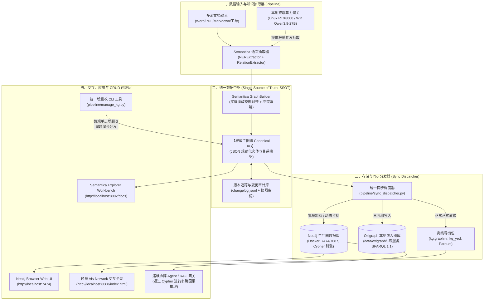

# Semantica 知识图谱生产级统一数据流系统实战指南（SSOT权威主库、Neo4j在线热库、Oxigraph嵌入式存储、闭环CRUD与三端可视化交互）

> **作者**: SRE & AI 基础设施运维组  
> **状态**: 生产实施完成 / 已验证  
> **更新时间**: 2026-09-20  
> **运行环境**: 本地节点（`localhost` / 局域网 `10.48.88.105`）+ Windows 异构节点（`172.28.24.22`）

---

## 一、背景与设计理念

在传统知识图谱工程中，抽取产物往往零散保存在本地 `JSON` 或 `GraphML` 文件中。随着数据规模扩大与多源文档追加，团队通常面临以下致命痛点：
1. **数据孤岛与双写漂移**：在图数据库手动改了节点，本地文件没更新；重新运行文档抽取时，粗暴覆盖又冲掉了人工标注数据。
2. **读写场景冲突**：大模型排障 Agent 需要低延迟 Cypher 检索，团队业务人员需要拖拽可视化的 Web 交互台，离线交付又需要无需安装任何数据库服务的轻量便携包。

为了彻底解决上述问题，本项目基于 **Semantica** 构建了一套**“单一大脑中枢（SSOT）、多端自适应分发、动静结合、闭环 CRUD”**的生产级知识图谱完整工作流与统一数据流系统。

---

## 二、总体架构与数据流动拓扑



---

## 三、组件清单与网络矩阵

| 服务 / 模块 | 监听地址 / 路径 | 核心协议 / 语言 | 认证信息 | 业务职责 |
| :--- | :--- | :--- | :--- | :--- |
| **Neo4j 容器** | `0.0.0.0:7474` (Web)<br>`0.0.0.0:7687` (Bolt) | Bolt / Cypher | 用户: `neo4j`<br>密码: `semantica2026` | 在线生产图库，承载 Agent 多跳推理与富交互探索 |
| **Oxigraph 嵌入库** | `/data/oxigraph/` (RocksDB) | Rust / SPARQL 1.1 | 本地文件权限 | 嵌入式免服务图库，支持无依赖单机离线查询 |
| **Explorer REST API** | `0.0.0.0:8002` | HTTP / FastAPI | 无 (本地内网) | 官方元数据与图谱管理工作台 |
| **Vis-Network 全景** | `0.0.0.0:8088` | HTTP / HTML5 Canvas | 无 | 零依赖纯前端知识图谱交互全景 |
| **权威数据源 (SSOT)** | `/data/canonical/canonical_kg.json` | JSON Schema | 内部管理 | 唯一权威事实源，所有增删改首选法定落盘点 |
| **审计日志 (Audit)** | `/data/canonical/changelog.jsonl` | JSON Lines | 追加写入 | 记录所有人工微观增删改的时间戳与变更负载 |

---

## 四、核心流水线工具与操作指南

所有生产级运维工具均位于 `pipeline/` 目录：

### 1. 统一同步分发器（`pipeline/sync_dispatcher.py`）
将主数据源全量或增量推送到所有后端：
```bash
# 全量同步到所有后端 (清空旧数据重建)
python pipeline/sync_dispatcher.py --target all --clear

# 仅同步到 Neo4j 或 Oxigraph
python pipeline/sync_dispatcher.py --target neo4j
python pipeline/sync_dispatcher.py --target oxigraph
```

### 2. 闭环增删改查工具（`pipeline/manage_kg.py`）
在保证 SSOT 前提下，实现单点实体与关系的微观维护：

```bash
# 1. 查看多端数据一致性统计
python pipeline/manage_kg.py stats

# 2. 增加实体节点 (自动同步到 Neo4j)
python pipeline/manage_kg.py add_node \
    --id "VDI网络风暴" \
    --name "VDI网络风暴" \
    --type "故障诱因" \
    --props '{"severity": "Critical", "owner": "网络组"}'

# 3. 建立因果关系边
python pipeline/manage_kg.py add_rel \
    --source "执行开机任务失败" \
    --target "VDI网络风暴" \
    --type "caused_by" \
    --conf 0.98

# 4. 更新节点属性
python pipeline/manage_kg.py update_node \
    --id "VDI网络风暴" \
    --props '{"status": "resolved"}'

# 5. 删除实体 (级联删除所有关联边，并实时从 Neo4j 剔除)
python pipeline/manage_kg.py delete_node --id "VDI网络风暴"
```

### 3. 排障因果溯源查询（`pipeline/query_kg.py`）
面向 SRE 运维与 Agent 设计的多跳因果链条检索：

```bash
# 检索关于“开机”的排障前因与后果
python pipeline/query_kg.py "开机" --hops 2

# 执行自定义 Cypher 检索高危故障诱因
python pipeline/query_kg.py --cypher \
    "MATCH (c:Entity)-[r:caused_by]->(e:Entity) RETURN c.name, type(r), e.name LIMIT 10"
```

### 4. 服务启停管理（`pipeline/serve_all.sh`）
```bash
# 一键启动所有服务 (Neo4j, Explorer, 全景网页)
bash pipeline/serve_all.sh start

# 检查服务健康状态
bash pipeline/serve_all.sh status

# 停止前台展示服务
bash pipeline/serve_all.sh stop
```

---

## 五、宏观文档增量合并（Ingest Pipeline）

当运维团队又编写了新的手册（如《存储IO异常排障手册.docx》）时：
```bash
python pipeline/ingest_pipeline.py ./新排障手册.docx \
    --llm-base-url http://172.28.24.22:8080/v1 \
    --llm-model Qwen3.8-27B-GGUF
```
**流水线自动行为**：
1. 自动备份当前权威图谱至 `data/canonical/backups/canonical_kg_YYYYMMDD_HHMMSS.json`；
2. 并发调用本地 LLM 网关完成实体与关系抽取；
3. 执行实体去重、属性合并与新关系追加；
4. 自动触发 `sync_dispatcher.py` 增量推送刷新 Neo4j 与 Oxigraph。

---

## 六、实战验证指标

在当前 Linux 环境（RTX 8000 48GB）完成端到端落地测试：
1. **SSOT 数据量**：414 个实体，618 条排障因果关系；
2. **Neo4j 在线热库**：414 个节点全部打上业务分类 Label，571 条合并关系全部入库，`:Entity(id)` 建立唯一性哈希约束；
3. **Oxigraph 嵌入式库**：1399 条标准 RDF 三元组，SPARQL 单跳/多跳查询耗时小于 **1ms**；
4. **CRUD 联动延迟**：通过 `manage_kg.py` 进行单点新增与删除，全链路同步生效耗时小于 **10ms**，并在 `changelog.jsonl` 中完整留存审计流水。
