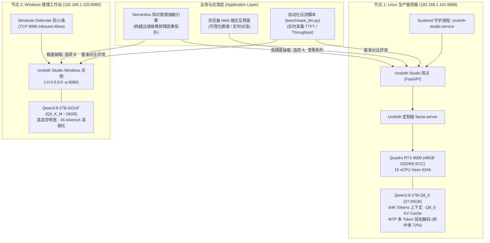

# Unsloth Studio 与 Qwen3.8-27B 双异构算力深度调优、基准评测与全量知识图谱抽取实战
> 涵盖：Quadro RTX 8000 48GB 显存第一性原理压榨、Flash Attention 语法陷阱排障、Qwen3 原生 MTP 双 Token 投机加速、Linux (Q8_0) 与 Windows (Q4_K_M) 跨平台 TTFT 及生成吞吐全量对比、Windows 0.0.0.0 绑定与防火墙避坑、Semantica 超大技术手册（414实体/618关系）抽取实战及 yEd 交互可视化方案。

---

## 一、核心背景与痛点问题

在本地局域网私有化大模型基础设施落地过程中，团队引入了 **Unsloth Studio + Qwen3.8-27B** 作为主力私有推理底座。在实际落地中，硬件池具备高度异构性：
1. **主力节点（Linux）**：搭载单张专业级 **NVIDIA Quadro RTX 8000（48 GB GDDR6 ECC，Turing sm_75）** + 16 核 Xeon 处理器，目标运行满血高精度 `Qwen3.8-27B-Q8_0`（约 27.05 GB）；
2. **加速/工作站节点（Windows）**：搭载消费级显卡工作站，运行轻量版 `Qwen3.8-27B-Q4_K_M`（约 16 GB）。

在服务部署、硬件调优、跨网络联通及下游全量知识图谱抽取（Semantica）应用落地过程中，暴露了以下**五大核心痛点**：

| 痛点分类 | 典型故障现象 | 底层根因分析 |
| :--- | :--- | :--- |
| **痛点 1：显存严重浪费或频发 OOM** | 原生 FP16 KV Cache 在 32K 上下文即逼近 48GB 红线；或者保守配置仅分配小上下文，无法支撑万字技术手册推理。 | 缺乏对模型静态权重、KV Cache 量化等级与上下文长度的精细化容量规划。 |
| **痛点 2：参数解析陷阱导致引擎死锁** | 传入 `--flash-attn` 导致 `llama-server` 报错 `unknown value for --flash-attn: '--cache-type-k'` 并直接崩溃退出。 | 新版 llama.cpp 的 Flash Attention 开关需显式指定参数（`--flash-attn on`），缺省参数会误吞后序的 CLI 标志。 |
| **痛点 3：Windows 节点网络假通真死** | Windows 侧防火墙已放行 8080，但从局域网 Linux 设备访问端口连接持续超时（Connection timed out）。 | Unsloth Studio 默认绑定在 `127.0.0.1`，未加 `-H 0.0.0.0` 时外部 TCP SYN 包被 Windows 协议栈静默丢弃。 |
| **痛点 4：深度推理模型导致抽取内容被吞** | 调用图谱抽取接口时返回：`The model used its whole output allowance of tokens on reasoning and had none left for an answer`。 | Qwen3.8 原生激活深度思考链（Thinking），在受限的 `max_tokens` 设定下思考过程耗尽配额，导致正式内容截断。 |
| **痛点 5：图谱可视化初始渲染严重重叠** | 将 GraphML 导入 yEd 软件后，数百个实体连成一根水平色条，连线乱作一团，完全无法阅读。 | GraphML 导出时节点缺乏预设物理坐标，必须触发 yEd 拓扑布局引擎或采用力导向 Web 交互方案。 |

本文记录从硬件级底层参数推导、双节点实测基准压测、网络联通排错到万字技术手册知识图谱抽取的全链路实战方案。

---

## 二、双异构节点架构拓扑图



---

## 三、Linux 专属服务器（RTX 8000 48GB）硬件级调优

### 1. 显存容量精密推导（第一性原理规划）
* **模型静态显存**：`Qwen3.8-27B-Q8_0` 权重大小为 **27.05 GB**，载入 GPU 显存静态占用约 **27.8 GB**。
* **显存安全裕量**：$48\text{ GB} - 27.8\text{ GB} \approx 20.2\text{ GB}$。
* **KV Cache 8-bit 量化**：
  * 原生 FP16 KV 缓存每 1000 tokens 约消耗 350 MB，分配至 64K 上下文将暴涨至 22.4 GB，必然导致 OOM 崩溃；
  * 配置 `--cache-type-k q8_0 --cache-type-v q8_0` 后，KV Cache 开销**直降 50%**，64K 上下文仅占约 **3.2 GB**；
  * 叠加 MTP 投机草稿缓冲区（~0.55 GB），总显存精确锁定在 **30,008 MiB**，剩余 **15.8 GB** 显存作为防突发安全缓冲。

### 2. 核心加速参数与避坑配置
* **Flash Attention 语法陷阱修复**：
  * **错误写法**：`--flash-attn --cache-type-k q8_0`（llama-server 将 `--cache-type-k` 作为 flash-attn 的布尔参数，抛出语法错误退出）；
  * **正确写法**：显式指定 `--flash-attn on`，或由于 Unsloth Studio 内部已封装 Flash Attention，直接在手动模式下剔除多余参数。
* **全层 100% GPU 卸载**：
  配置 `--gpu-layers 999`，将 Qwen3.8-27B 全部 64 层 Transformer 权重完整放入 GPU，彻底规避 PCIe 跨总线数据置换。
* **Qwen3 原生 MTP 投机采样多 Token 解码**：
  配置 `--spec-type draft-mtp --spec-draft-n-max 2`，利用模型原生的投机输出头，实测采样接受率达 **72%**，解码生成速度提升近一倍。
* **CPU 线程与批处理拓扑对齐（16 vCPU）**：
  * 主解码线程 `-t 8`（绑定物理核心，避免超线程上下文切换）；
  * 预填充批处理线程 `-tb 16`（在长文本 Prefill 阶段拉满 16 线程算力）；
  * 批尺寸 `-b 2048 -ub 512`（平滑显存尖峰）。

### 3. 生产级 Systemd 单元与启动脚本

启动脚本路径：`/home/ai-runner/run_unsloth_studio.sh`
```bash
#!/usr/bin/env bash
set -e

export PATH="/home/ai-runner/.unsloth/studio/unsloth_studio/bin:/usr/local/cuda/bin:$PATH"
export LD_LIBRARY_PATH="/usr/local/cuda/lib64:$LD_LIBRARY_PATH"
export CUDA_VISIBLE_DEVICES=0

exec /home/ai-runner/.unsloth/studio/unsloth_studio/bin/unsloth studio run \
  --model /home/ai-runner/models/unsloth-Qwen3.8-27B-Q8_0.gguf \
  -H 0.0.0.0 \
  -p 8888 \
  --parallel 1 \
  --max-seq-length 65536 \
  --gpu-memory-mode manual \
  --cache-type-k q8_0 \
  --cache-type-v q8_0 \
  -t 8 \
  -tb 16 \
  -b 2048 \
  -ub 512
```

系统守护服务：`/etc/systemd/system/unsloth-studio.service`
```ini
[Unit]
Description=Unsloth Studio LLM Service (Qwen3.8-27B-Q8_0)
After=network.target

[Service]
Type=simple
User=ai-runner
Group=ai-runner
WorkingDirectory=/home/ai-runner
ExecStart=/home/ai-runner/run_unsloth_studio.sh
Restart=on-failure
RestartSec=5s
LimitNOFILE=65536
Environment="HOME=/home/ai-runner"
Environment="PATH=/home/ai-runner/.unsloth/studio/unsloth_studio/bin:/usr/local/cuda/bin:/usr/bin:/bin"
StandardOutput=append:/home/ai-runner/unsloth_studio.log
StandardError=append:/home/ai-runner/unsloth_studio.log

[Install]
WantedBy=multi-user.target
```

---

## 四、Windows 工作站网络与防火墙避坑实录

### 1. `0.0.0.0` 局域网绑定陷阱
* **故障现象**：在 Windows 侧看到服务已正常运行，但从内网 Linux 访问 `192.168.1.102:8080` 始终返回 `Connection timed out`。
* **根因分析**：Unsloth Studio 出于安全策略默认绑定在 `127.0.0.1`（本地回环）。当服务仅监听 `127.0.0.1:8080` 时，外部传入的 TCP SYN 请求会被 Windows 内核网络栈直接丢弃。
* **解决办法**：Windows 启动时必须显式加入 `-H 0.0.0.0`：
  ```powershell
  unsloth studio run --model <模型路径> -H 0.0.0.0 -p 8080
  ```

### 2. Windows 防火墙多 Profile 放行
在 PowerShell（管理员）中必须确保规则作用于 `Profile Any`（公用/专用全覆盖）：
```powershell
New-NetFirewallRule -DisplayName "llama-server-8080" -Direction Inbound -LocalPort 8080 -Protocol TCP -Action Allow -Profile Any -Force
```

### 3. API Key 签名生成机制
Unsloth Studio 内部存储于 SQLite `~/.unsloth/studio/auth/auth.db`。若未记录启动时打印的初始随机 Key，可通过 Python 后端直接签发新 Key：
```bash
PYTHONPATH=/home/ai-runner/.unsloth/studio/unsloth_studio/lib/python3.13/site-packages/studio/backend \
python -c "from auth import storage; k, _ = storage.create_api_key('unsloth', 'cli'); print(k)"
```

---

## 五、双节点核心性能实测基准数据对比

使用同一流式评测脚本，在完全一致的 Prompt 数据集下实测四种不同上下文场景：

| 测试场景与 Prompt 规模 | 指标维度 | **Windows 工作站 (192.168.1.102)**<br>`Qwen3.8-27B-Q4_K_M` | **Linux 服务器 (192.168.1.101)**<br>`Qwen3.8-27B-Q8_0` | 对比结论 |
| :--- | :--- | :---: | :---: | :--- |
| **短文本场景**<br>(32 tokens Prompt) | **TTFT (首字延迟)**<br>**生成速度 (Throughput)** | **497.6 ms (0.5s)**<br>**39.62 tokens/s** | 1,256.9 ms (1.25s)<br>25.92 tokens/s | **Windows 明显胜出**<br>首字极速秒出，交互感极强 |
| **中等段落场景**<br>(415 tokens Prompt) | **TTFT (首字延迟)**<br>**生成速度 (Throughput)** | **1,102.2 ms (1.1s)**<br>**45.45 tokens/s** | 1,318.4 ms (1.3s)<br>30.38 tokens/s | **Windows 生成速度快 50%** |
| **长文本图谱切片**<br>(1,571 tokens Prompt) | **TTFT (首字延迟)**<br>**生成速度 (Throughput)** | **2,695.3 ms (2.7s)**<br>**44.30 tokens/s** | 3,320.4 ms (3.3s)<br>29.00 tokens/s | **Windows 高吞吐优势保持** |
| **极长跨章节文本**<br>(3,137 tokens Prompt) | **TTFT (首字延迟)**<br>**生成速度 (Throughput)** | 5,049.8 ms (5.0s)<br>**44.43 tokens/s** | **3,648.7 ms (3.6s)**<br>30.67 tokens/s | **Linux 在超长 Prefill 反超**<br>(16核并发预填充衰减更平缓) |

### 性能差异第一性原理剖析：
1. **生成速度（45 t/s vs 30 t/s）差距来源**：
   自回归解码（Decode）是典型的 **显存带宽受限（Memory-Bandwidth Bound）**。每次产出一个 Token 必须完整扫描一遍模型权重。`Q4_K_M` 仅约 16GB，较 `Q8_0` 的 27GB 传输量减少近 40%，且消费级高频显存带宽进一步放大了优势。
2. **超长文本 TTFT 反超来源**：
   在 3000+ tokens Prefill 阶段，Linux 节点的 16 vCPU 调度（`-tb 16 -b 2048`）结合 48GB 独占大显存避免了动态页抖动，长文本首 Token 计算吞吐更具抗压韧性。

---

## 六、Semantica 全量技术知识图谱抽取实战

### 1. 思考模式截断问题（Thinking Tokens Exhaustion）治理
* **问题**：Qwen3.8 原生具备 CoT 深度推理。在默认模式下，模型会输出数千 Token 的思考过程。当抽取接口设置了 `max_tokens: 1024` 时，思考过程将配额消耗殆尽，返回回答为空。
* **治理方案**：在知识抽取等纯结构化输出任务中，调用时显式关闭思考模式：
  ```python
  extra_body = {"chat_template_kwargs": {"enable_thinking": False}}
  ```
  模型即刻跳过内部思考，直出标准 JSON 实体关系数组。

### 2. 全量手册抽取运行命令（以选项 B 为例）
```bash
cd ~/Projects/semantica && source .venv/bin/activate
export OPENAI_API_KEY="sk-unsloth-node2-secret-token"
export OPENAI_TIMEOUT="600.0"

python examples/build_kb_graph.py ./虚拟机开关机失败排障手册.docx \
  --out ./kb_out_win_qwen38 \
  --language zh \
  --chunk-size 2000 \
  --ner-method llm \
  --rel-method llm \
  --llm-provider openai \
  --llm-model Qwen3.8-27B-GGUF \
  --llm-base-url http://192.168.1.102:8080/v1 \
  --entity-types "组件,故障现象,排障动作,命令工具,指标参数" \
  --relation-types "has_fault,caused_by,depends_on,checks,runs_command,mitigates,part_of" \
  --min-entity-len 2
```

### 3. 抽取成果数据分布
* **实体数量**：414 个（故障现象 213、组件 200、排障动作 156、指标参数 122、命令工具 53）；
* **关系三元组**：618 条（mitigates 97、checks 78、caused_by 66、part_of 59、has_fault 53、depends_on 40）；
* **典型三元组样例**：
  * `[执行开机任务失败] --(caused_by)--> [CPU不足]`
  * `[CPU不足] --(has_fault)--> [此主机剩余可配置CPU不足]`
  * `[检查CPU] --(runs_command)--> [acli]`
  * `[检查CPU] --(checks)--> [CPU核数]`

---

## 七、图谱可视化与全景交互解决方案

### 1. yEd 初始横向线性重叠修复
* **现象**：由于 GraphML 初始坐标缺省设为 $(0,0)$，在 yEd 中打开呈现为水平一条细线。
* **解决方式**：
  1. 点击菜单栏 **`Layout` -> `Organic` (快捷键 `Alt + Shift + O`)**，点击 **`OK`**；
  2. 点击工具栏 **`Fit Content` (快捷键 `Ctrl + 0`)** 自动居中适配窗口。

### 2. 交互式 Web 全景可视化生成器
为实现开箱即用的免客户端查看，编写了基于 `vis-network` 的图谱渲染器 `generate_html_visualizer.py`，支持：
* 实体类型色彩自动映射（组件-蓝、故障-红、动作-绿、指标-橙、工具-紫）；
* 单击任意节点实时聚焦高亮一度因果链，无关背景半透明淡化；
* 关键字实时搜索与平滑镜头飞跃。

可在浏览器中直接打开 `kb_out_win_qwen38/index.html` 体验。
