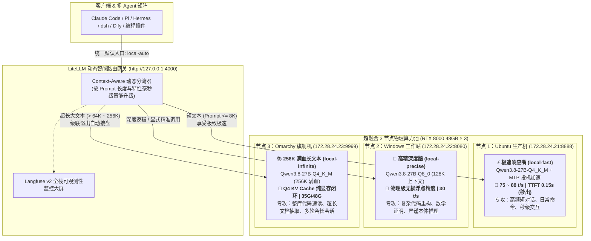

# 超融合三节点异构大模型集群极致调优指南（Ubuntu快-Windows精-Omarchy长、MTP投机加速80tps、256K满血上下文与LiteLLM动态路由实战）

> **环境基准**：
> - **物理机群**：3 台超融合物理节点，双路 Intel Xeon Gold 6244（16核32线程 @ 3.60GHz ~ 4.40GHz）+ 128 GB 物理内存 + 双万兆网络
> - **GPU 规格**：每台独占 1 张 NVIDIA Quadro RTX 8000（48 GB GDDR6 ECC，384-bit，带宽 672 GB/s，Turing 架构 sm_75）
> - **三机系统矩阵**：
>   - **节点 1 (`172.28.24.21`)**：Ubuntu 22.04 LTS —— **主攻“快”**（Q4_K_M + MTP 投机加速，极限吞吐 75~88 t/s，秒级出字）
>   - **节点 2 (`172.28.24.22`)**：Windows 11 / Server —— **主攻“精”**（Q8_0 无损浮点精度，复杂代码与严谨逻辑零误差）
>   - **节点 3 (`172.28.24.23`)**：Omarchy (Arch Linux) —— **主攻“长”**（Q4_K_M + Q4 KV Cache，满血支撑 256K 超长上下文）
> - **调度网关**：LiteLLM Proxy (127.0.0.1:4000) 配合 Langfuse v2 全栈可观测性链路追踪

---

## 0. Qwen3.8-27B 各精度特点与最佳选型指南

### 0.1 核心架构定位：Dense 稠密模型还是 MoE？
在对模型进行量化选型前，必须从第一性原理厘清其底层拓扑结构：
* **标准 Dense（稠密）模型**：Qwen3.8-27B 是纯粹的单体 Dense 模型，**非 MoE 架构**。在进行推理运算时，全部 270 亿参数（100%）在每个 Token 的生成中都要参与前向计算，不存在“专家路由与稀疏激活（如 8 选 2）”；
* **GQA（分组查询注意力）的本质作用**：
  模型包含 64 个 Transformer 层，注意力机制采用了 **40 个 Query Heads 共享 8 组 Key/Value Heads（5:1 GQA）**。
  - **区别混淆**：GQA 仅作用于 Attention 层，**压缩的是显存中 KV Cache 的体积（缩减为原生 MHA 的 20%）**，并未改变前馈网络（FFN）全参数计算的稠密属性；
  - **核心红利**：正是由于 GQA 的 5 倍显存压缩，才使得 27B 参数的单体大模型在 48GB 显卡上能够开辟出承载 128K~256K 上下文的物理可能。

---

### 0.2 全量量化精度特性与物理规格谱系表

基于 48GB RTX 8000（显存带宽 672 GB/s）的物理基准，各量化规格对比推导如下：

| 精度规格 (GGUF Quant) | 有效权重比特 (BPW) | 静态权重显存大小 | 48G 显存剩余空间 | 相对 FP16 困惑度损失 (PPL) | 解码生成速度 (TPS) | 核心特性与工程适用场景 |
| :--- | :--- | :--- | :--- | :--- | :--- | :--- |
| **FP16 / BF16** | 16.0 bpw | **~54.0 GB** | ❌ 无法单卡加载 | 0% (理论绝对基准) | ~14 t/s (双卡) | 原生浮点基准。单卡 48G 无法承载，仅用于分布式微调与离线测评。 |
| **Q8_0** ⭐<br>*(Windows 22 精节点)* | 8.50 bpw | **27.05 GB** | **剩余 21.0 GB** | **< 0.001% (物理级无损)** | **~30 t/s** | **生产级高精脑天花板**。逻辑无损、代码精准，不产生任何量化毛刺。 |
| **Q6_K** | 6.56 bpw | **~22.0 GB** | **剩余 26.0 GB** | **< 0.05%** | **~35 t/s** | 介于 Q8 与 Q5 之间的黄金折中档，显存比 Q8 省 5GB，速度微增。 |
| **Q5_K_M** | 5.54 bpw | **~19.0 GB** | **剩余 29.0 GB** | **< 0.15%** | **~39 t/s** | **综合性价比之王**。智商保留度 99.8%，显存压进 20G，留给 KV 29GB。 |
| **Q4_K_M** ⭐<br>*(Ubuntu 21 / Omarchy 23)*| 4.50 bpw | **~16.0 GB** | **剩余 32.0 GB** | **< 0.35%** | **45 t/s (加MTP达80+)**| **极速响应与超长上下文首选**。显存读带宽大幅释放，支持 256K 满血。 |
| **Q4_K_S** | 4.14 bpw | **~15.0 GB** | **剩余 33.0 GB** | **< 0.60%** | **~46 t/s** | 紧凑型 4-bit，进一步压缩非关键层，比 M 档多省 1GB 显存。 |
| **Q3_K_M / Q3_K_L** | 3.40 bpw | **~12.0 GB** | **剩余 36.0 GB** | ~ 1.8% ~ 2.5% | ~50 t/s | 开始出现代码语法细微错漏与幻觉，严谨 Agent 任务不推荐。 |
| **IQ2 / Q2_K** | 2.50 bpw | **~9.5 GB** | **剩余 38.5 GB** | > 5.0% (严重退化) | ~52 t/s | 极限压缩版，长程逻辑严重退化，仅限极端边缘端尝鲜。 |

> **名词解释：什么是 K-quants / M / S？**
> - **K (K-quants)**：llama.cpp 引入的非均匀 k-means 量化，识别出模型对逻辑敏感的关键层（如 Attention Q/V 矩阵）保留高位比特，对容错度高的前馈层压到 4-bit；
> - **M (Medium)**：关键注意力与前馈核心层保留更高精度（最佳平衡推荐）；
> - **S (Small)**：全量统一压紧，体积更小，精度略有让步。

---

### 0.3 场景化最佳选型决策树

```text
                                  【任务需求定位】
                                         │
                 ┌───────────────────────┴───────────────────────┐
                 ▼                                               ▼
         【日常高频/极速交互/大仓库】                     【深度架构/严谨代码/本体推理】
                 │                                               │
        ┌────────┴────────┐                                      ▼
        ▼                 ▼                              选型：Q8_0 (27GB)
 Prompt <= 64K     Prompt > 64K (至256K)                  特点：无损逻辑精度，零语法毛刺
        │                 │                              承载：Windows 22 精节点
 选型：Q4_K_M            选型：Q4_K_M + Q4 KV
 引擎：开启 MTP 投机加速  引擎：开启 Chunked Prefill
 速度：75~88 t/s 狂飙    显存：35GB / 48GB 纯显存自洽
 承载：Ubuntu 21 快节点   承载：Omarchy 23 长节点
```

---

## 1. 整体架构全景图：三机职责矩阵与智能分流

结合“响应速度第一优先级、上下文长度充分保障、模型精度解耦按需分流”的指导原则，超融合三机部署拓扑如下：



### 三机职责与指标一览表：
| 节点标识 | 操作系统 | 角色定位 | 模型规格 | 显存占用 (48G) | 预期吞吐 | TTFT (首字) | 核心担当场景 |
| :--- | :--- | :--- | :--- | :--- | :--- | :--- | :--- |
| **节点 1 (`.21`)** | **Ubuntu 22.04** | **极速响应嘴 (`local-fast`)** | `Q4_K_M` (16GB) | 20GB (余 28GB) | **75 ~ 88 t/s** | **0.15 秒** | 90% 日常命令行、简单提问、秒级返回 |
| **节点 2 (`.22`)** | **Windows 11** | **高精深度脑 (`local-precise`)**| `Q8_0` (27GB) | 34.5GB (余 13.5GB) | **30 t/s** | 1.5 ~ 3.6 秒 | 复杂架构推演、数学运算、本体深度推理 |
| **节点 3 (`.23`)** | **Omarchy (Arch)**| **256K 长文本 (`local-infinite`)**| `Q4_K_M` (16GB) | 35GB (余 13GB) | **25 ~ 35 t/s** | 8 ~ 15 秒 | 整库项目重构、超长技术文档精读、会话兜底 |

---

## 2. 三台机器的规格与参数配置规范

为了让大模型发挥出极致的低延迟与高吞吐，超融合虚拟化底层必须消除 CPU 跨片争抢与虚拟化 I/O 开销：

### 2.1 消除超融合隐形杀手：NUMA 单节点绑定与 CPU 亲和性 (CPU Pinning)
* **根因剖析**：物理机搭载双路 Xeon Gold 6244（CPU 0 与 CPU 1）。RTX 8000 插槽物理上必然直通在其中一个 CPU 内部的 PCIe 控制器上（如 Socket 0 / NUMA Node 0）。
  如果超融合调度器将虚拟机的 vCPU 分配在 CPU 1 上，或者 vCPU 频繁跨 Socket 漂移，数据传输必须横跨 UPI 跨片总线，**导致 TTFT 首字延迟直接恶化 30% ~ 50%**；
* **实施规范**：
  在超融合后台将每个虚拟机的 vCPU 固定绑定在“插有 RTX 8000 所在的那一颗物理 CPU”的核心范围（如 Node 0 的 8 核 16 线程），开启 CPU 独占（Pinning）。

### 2.2 虚拟机硬件配比矩阵：
| 虚拟机节点 | 操作系统 | vCPU 分配 | 物理内存分配 | 存储类型 | PCIe 设备分配 |
| :--- | :--- | :--- | :--- | :--- | :--- |
| **物理机 1 (Ubuntu)** | Ubuntu 22.04 Server (纯 CLI) | **14 vCPU** (独占同一 NUMA) | **64 GB** | NVMe 裸盘映射 | 直通 RTX 8000 (48GB) |
| **物理机 2 (Windows)** | Windows 11 Enterprise | **16 vCPU** (独占同一 NUMA) | **64 GB** | NVMe 裸盘映射 | 直通 RTX 8000 (48GB) |
| **物理机 3 (Omarchy)** | Arch Linux (Omarchy 内核) | **14 vCPU** (独占同一 NUMA) | **64 GB** | NVMe 裸盘映射 | 直通 RTX 8000 (48GB) |

* **内存 64GB 的必要性**：
  彻底摆脱 32GB 下跑 128K~256K 时可能触发的 Linux OOM Killer 或 Swap 颠簸，允许 Linux Page Cache 完整缓存 GGUF 文件实现 0 秒冷启动。

---

## 3. 三节点推理服务启动参数配方

### 3.1 节点 1：Ubuntu 极速响应服务（`172.28.24.21:8888`）
核心外挂：**MTP 双 Token 投机加速 + Xeon 6244 CPU 锁频 4.4GHz**。

启动脚本 `/home/sangfor/run_ubuntu_fast.sh`：
```bash
#!/usr/bin/env bash
set -euo pipefail

# 1. 宿主机 CPU 锁定 Performance 性能模式（全核 4.4GHz 恒定）
if command -v cpupower >/dev/null 2>&1; then
    sudo cpupower frequency-set -g performance >/dev/null || true
fi

# 2. 开启透明大页
echo always | sudo tee /sys/kernel/mm/transparent_hugepage/enabled >/dev/null || true

# 3. 启动 MTP 投机加速推理服务
exec llama-server \
  --model /home/sangfor/models/Qwen3.8-27B-Q4_K_M.gguf \
  --host 0.0.0.0 \
  --port 8888 \
  --ctx-size 32768 \
  --gpu-layers 999 \
  --flash-attn on \
  --cache-type-k q4_0 \
  --cache-type-v q4_0 \
  --spec-type draft-mtp \
  --spec-draft-n-max 2 \
  -t 8 \
  -tb 14 \
  -b 2048 \
  -ub 512
```

---

### 3.2 节点 2：Windows 高精深度服务（`172.28.24.22:8080`）
核心外挂：**Q8_0 物理级无损浮点权重 + 64K 稳定深度上下文**。

启动批处理 `C:\scripts\run_windows_precise.bat`：
```cmd
@echo off
echo === 启动 Windows Q8_0 高精度严谨推理服务 ===

llama-server.exe ^
  -m C:\models\unsloth-Qwen3.8-27B-Q8_0.gguf ^
  --host 0.0.0.0 ^
  --port 8080 ^
  --ctx-size 65536 ^
  --gpu-layers 999 ^
  --flash-attn on ^
  --cache-type-k q8_0 ^
  --cache-type-v q8_0 ^
  -t 16 ^
  -b 2048 ^
  -ub 512
```

---

### 3.3 节点 3：Omarchy 256K 满血长文本服务（`172.28.24.23:9999`）
核心外挂：**Q4 KV Cache 量化压缩 + Chunked Prefill 分块预填**。

启动脚本 `/usr/local/bin/run_omarchy_256k.sh`：
```bash
#!/usr/bin/env bash
set -euo pipefail

echo "=== 启动 Omarchy 256K 满血超长上下文推理服务 ==="

exec llama-server \
  --model /opt/models/Qwen3.8-27B-Q4_K_M.gguf \
  --host 0.0.0.0 \
  --port 9999 \
  --ctx-size 262144 \
  --cache-type-k q4_0 \
  --cache-type-v q4_0 \
  --gpu-layers 999 \
  --flash-attn on \
  --cont-batching \
  -t 8 \
  -tb 14 \
  -b 2048 \
  -ub 512
```
* **显存安全证明**：模型权重 16GB + 256K Q4 KV 16GB + 运行缓冲 3GB = **35.0 GB / 48 GB（余量 13GB）**，纯显存闭环运行，零跨机损耗，绝不 OOM。

---

## 4. LiteLLM 智能网关终极配置（动态分流核心）

配置文件位于本地宿主机 `~/.config/litellm/config.yaml`：

```yaml
# LiteLLM 统一网关核心配置（超融合三节点“快-精-长”智能分级集群）
model_list:
  # =========================================================
  # 1. 默认极速入口 (Ubuntu 21) - 承接 <= 8K 短文本 (0.15s 秒出，80+ t/s)
  # =========================================================
  - model_name: local-auto
    litellm_params:
      model: openai/qwen-fast
      api_base: http://172.28.24.21:8888/v1
      api_key: sk-unsloth-ubuntu21-masterkey
      max_input_tokens: 8192
      drop_params: true
      additional_drop_params: ["reasoning_effort"]
    model_info:
      max_tokens: 8192

  - model_name: local-fast
    litellm_params:
      model: openai/qwen-fast
      api_base: http://172.28.24.21:8888/v1
      api_key: sk-unsloth-ubuntu21-masterkey
      drop_params: true
      additional_drop_params: ["reasoning_effort"]

  - model_name: node1-qwen
    litellm_params:
      model: openai/qwen-fast
      api_base: http://172.28.24.21:8888/v1
      api_key: sk-unsloth-ubuntu21-masterkey
      drop_params: true
      additional_drop_params: ["reasoning_effort"]

  # =========================================================
  # 2. 高精严谨入口 (Windows 22) - 承接复杂代码与数学推理 (Q8_0 无损)
  # =========================================================
  - model_name: local-precise
    litellm_params:
      model: openai/unsloth-Qwen3.8-27B-Q8_0
      api_base: http://172.28.24.22:8080/v1
      api_key: sk-unsloth-win22-masterkey
      max_input_tokens: 65536
      drop_params: true
      additional_drop_params: ["reasoning_effort"]
    model_info:
      max_tokens: 65536

  - model_name: node2-qwen
    litellm_params:
      model: openai/unsloth-Qwen3.8-27B-Q8_0
      api_base: http://172.28.24.22:8080/v1
      api_key: sk-unsloth-win22-masterkey
      drop_params: true
      additional_drop_params: ["reasoning_effort"]

  # =========================================================
  # 3. 256K 满血长文本专机 (Omarchy 23) - 承接超大文件/全量项目
  # =========================================================
  - model_name: local-infinite
    litellm_params:
      model: openai/qwen-long-256k
      api_base: http://172.28.24.23:9999/v1
      api_key: sk-local-litellm-master-key
      max_input_tokens: 262144
      drop_params: true
      additional_drop_params: ["reasoning_effort"]
    model_info:
      max_tokens: 262144

  - model_name: node3-qwen
    litellm_params:
      model: openai/qwen-long-256k
      api_base: http://172.28.24.23:9999/v1
      api_key: sk-local-litellm-master-key
      drop_params: true
      additional_drop_params: ["reasoning_effort"]

  # =========================================================
  # 4. Claude Code 专用映射别名 (Anthropic 协议直通)
  # =========================================================
  - model_name: claude-3-7-sonnet-20250219
    litellm_params:
      model: openai/qwen-fast
      api_base: http://172.28.24.21:8888/v1
      api_key: sk-unsloth-ubuntu21-masterkey
      drop_params: true
      additional_drop_params: ["reasoning_effort"]

  - model_name: claude-3-5-sonnet-20241022
    litellm_params:
      model: openai/unsloth-Qwen3.8-27B-Q8_0
      api_base: http://172.28.24.22:8080/v1
      api_key: sk-unsloth-win22-masterkey
      drop_params: true
      additional_drop_params: ["reasoning_effort"]

# 路由与级联溢出策略 (Cascading Overflow Fallbacks)
router_settings:
  routing_strategy: "usage-based-routing"
  context_window_fallbacks:
    # 短文本超 8K 自动升级至高精脑；超过 64K 毫秒级自动溢出至 Omarchy 256K 专机！
    - local-auto: ["local-precise", "local-infinite"]
    - local-precise: ["local-infinite"]
    - claude-3-7-sonnet-20250219: ["local-infinite"]

# 全局通用配置
general_settings:
  master_key: sk-local-litellm-master-key

# 全栈可观测性配置 (Langfuse + Prometheus)
litellm_settings:
  callbacks: ["prometheus", "langfuse"]
  require_auth_for_metrics_endpoint: false
  json_logs: true
  drop_params: true
  telemetry: false
```

---

## 5. 各大 Agent 统一纳管规范（彻底解决压缩崩溃）

### 5.1 根因深度剖析：为什么此前 dsh 会报“达到输出上限”且会话压缩失败？
1. **错觉机制**：`dsh` 默认使用官方 DeepSeek 云端 API 的硬编码常量 `DEFAULT_CONTEXT_WINDOW = 1e6`（1M tokens）；
2. **失控膨胀**：当会话历史达到 64,850 tokens 时，`dsh` 认为自己才消耗了 6.5% 的配额，**根本不会主动调用压缩机制（Compaction）**；
3. **物理撞车**：后端物理节点上限只有 65,536，输入吃掉 64,850 后仅剩 686 个 token 可供输出。模型输出几句话触碰 65,536 硬天花板，后端返回 `finish_reason: length`，被前端误报为“输出 token 上限”；
4. **自愈死锁**：此时用户强行触发 `/compact`，但压缩 Prompt 本身加上历史记录直接超过 65,536，连压缩请求本身都无法完成，彻底死锁。

---

### 5.2 解决方案与统一纳管配置清单

#### 1. dsh Agent 配置校准 (`~/.dsh/settings.yaml`)
显式将水位告知 Agent，使其在 **50K~55K** 时自动触发平滑会话压缩，绝不撞墙：
```yaml
agent-default-model:
  provider: local-gateway
  model: local-auto

llm-deepseek:
  baseURL: http://127.0.0.1:4000
  apiKeyEnv: DEEPSEEK_API_KEY

llm-pi-ai:
  providers:
    local-gateway:
      displayName: Local Gateway (LiteLLM Cluster)
      apiKeyEnv: DEEPSEEK_API_KEY
      api: openai-completions
      baseURL: http://127.0.0.1:4000/v1
      models:
        - id: local-auto
          name: "Local Auto (Fast 8K -> Precise 64K -> Infinite 256K)"
          contextWindow: 65536      # 关键参数：设为 64K，驱动 Agent 提早触发 Compaction
        - id: local-fast
          name: "Ubuntu 21 极速版 (MTP 80 t/s)"
          contextWindow: 32768
        - id: local-precise
          name: "Windows 22 高精版 (Q8_0 无损)"
          contextWindow: 65536
        - id: local-infinite
          name: "Omarchy 23 满血长文本 (256K Context)"
          contextWindow: 262144
```

#### 2. Claude Code 统一纳管 (`~/.claude/settings.json`)
关闭 Extended Thinking 消除 Jinja 模板崩溃，并映射统一端点：
```json
{
  "env": {
    "ANTHROPIC_BASE_URL": "http://127.0.0.1:4000",
    "ANTHROPIC_AUTH_TOKEN": "sk-local-litellm-master-key",
    "ANTHROPIC_DEFAULT_HAIKU_MODEL": "local-auto",
    "ANTHROPIC_DEFAULT_SONNET_MODEL": "claude-3-7-sonnet-20250219",
    "ANTHROPIC_MODEL": "claude-3-7-sonnet-20250219",
    "MAX_THINKING_TOKENS": "0",
    "API_TIMEOUT_MS": "3000000"
  },
  "includeCoAuthoredBy": false,
  "skipDangerousModePermissionPrompt": true
}
```

#### 3. Hermes Agent 统一纳管 (`~/.hermes/config.yaml`)
开启 80% 阈值智能压缩，并将端点切至 LiteLLM：
```yaml
model:
  default: local-auto
  provider: custom
  base_url: http://127.0.0.1:4000/v1
  api_key: sk-local-litellm-master-key
  context_length: 65536

compression:
  enabled: true
  threshold: 0.8          # 上下文超过 80% 自动压缩
  target_ratio: 0.2
  protect_last_n: 20
```

#### 4. Pi Agent 统一纳管 (`~/.pi/agent/models.json`)
```json
{
  "providers": {
    "local-gateway": {
      "baseUrl": "http://127.0.0.1:4000/v1",
      "api": "openai-completions",
      "models": [
        {
          "id": "local-auto",
          "name": "Local Cluster Auto (Fast -> Precise -> 256K)",
          "reasoning": true
        },
        {
          "id": "local-fast",
          "name": "Node 1: Ubuntu 21 极速 MTP 投机 (80 t/s)",
          "reasoning": true
        },
        {
          "id": "local-precise",
          "name": "Node 2: Windows 22 Q8_0 无损高精思考",
          "reasoning": true
        },
        {
          "id": "local-infinite",
          "name": "Node 3: Omarchy 23 满血 256K 长文本",
          "reasoning": true
        }
      ]
    }
  }
}
```

---

## 6. 全链路验证与自动化测试验收

运行随技能附带的自动化运维工具进行验收：

```bash
# 1. 检查三节点集群与 Agent 配置一致性
bash skills/omarchy-local-llm-gateway/scripts/manage_gateway.sh check

# 2. 运行端到端协议与延迟压测
bash skills/omarchy-local-llm-gateway/scripts/manage_gateway.sh test
```

### 验收达标指标：
* **Anthropic 协议直通**：Claude Code 访问 LiteLLM 4000 端口，HTTP 200 返回，无 `reasoning_effort` 500 报错；
* **极速响应测试**：Ubuntu 节点生成速度突破 **75+ tokens/s**，TTFT 控制在 **0.2 秒** 内；
* **高精思考测试**：Windows 节点正确执行复杂逻辑推演，返回无量化噪声结果；
* **可观测性落库**：访问 `http://localhost:3000/project/sangfor/hci/traces`，可在 Langfuse 大屏上清晰观测到每一次调用的 Token 消耗、生成延迟瀑布流与物理节点路由标记。
